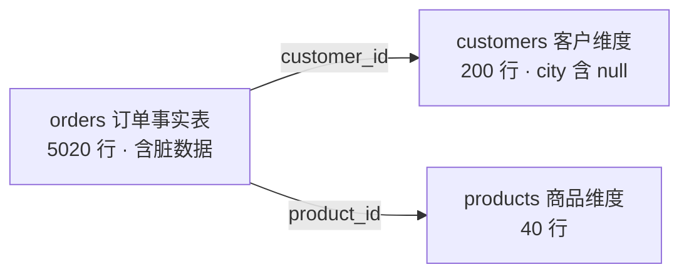

# Polars 深度教程：从零到地道

> 面向"完全没接触过 Polars"的学习者，用**心智模型 → 模块拆解 → 实操落点**的路径，带你理解 Polars 到底是什么、为什么快、以及如何写出地道（而非"pandas 翻译腔"）的代码。
>
> 全程以 **pandas（命令式）+ DuckDB/SQL（声明式）双对照**展开——因为理解一个工具最快的方式，是看清它与"对照组"的差异。

---

## 这不是速查表，是一条学习路径

如果你只想要 API 速查，官方文档更合适。这套教程的价值在于**建立心智模型**，让你在遇到新问题时知道"该用哪类抽象"，而不是死记 API。

建议**按顺序**读，每篇文档配一个可运行的代码文件，边读边跑：

### 第一步：建立认知地图（先读这个）

从 [心智模型总纲](src/content/docs/index.md) 开始。它回答"Polars 是什么、为什么快、Eager vs Lazy"，并给出贯穿全书的对照方法论。**读完它再决定后面怎么走。**

配套：[code/00_intro.py](code/00_intro.py) 用同一个任务展示 pandas / Polars Eager / Polars Lazy / DuckDB 四种写法，30 秒建立直觉。

### 第二步：地基层——Polars 与 pandas 分道扬镳的地方

这三节是"Polars 手感"的来源，**不懂这里就永远在写翻译腔**：

- 01 数据结构与 Arrow 内存：DataFrame 到底是什么 · [文档](src/content/docs/01-data-structures.md) · [代码](code/01_data_structures.py)
- 02 表达式系统 Expression：Polars 的灵魂（最重要一节）· [文档](src/content/docs/02-expressions.md) · [代码](code/02_expressions.py)
- 03 四大上下文 Contexts：表达式在哪里求值 · [文档](src/content/docs/03-contexts.md) · [代码](code/03_contexts.py)

### 第三步：引擎层——Polars 的"大脑"

- 04 惰性执行与查询优化器：Lazy、下推优化、explain 剖析 · [文档](src/content/docs/04-lazy-optimizer.md) · [代码](code/04_lazy_optimizer.py)

### 第四步：操作层——覆盖日常 90% 的数据处理

- 05 聚合、分组与窗口函数 · [文档](src/content/docs/05-aggregation.md) · [代码](code/05_aggregation.py)
- 06 连接 Join 与拼接 · [文档](src/content/docs/06-joins.md) · [代码](code/06_joins.py)
- 07 数据重塑 pivot / unpivot / explode · [文档](src/content/docs/07-reshape.md) · [代码](code/07_reshape.py)
- 08 字符串 · List · Struct 复杂类型 · [文档](src/content/docs/08-complex-types.md) · [代码](code/08_complex_types.py)
- 09 时间序列处理 · [文档](src/content/docs/09-time-series.md) · [代码](code/09_time_series.py)

### 第五步：生产层——落地与优化

- 10 IO 与流式引擎 · [文档](src/content/docs/10-io-streaming.md) · [代码](code/10_io_streaming.py)
- 11 性能剖析与最佳实践（含真实 benchmark）· [文档](src/content/docs/11-performance.md) · [代码](code/11_performance.py)
- 12 从 pandas 迁移与 SQL 接口 · [文档](src/content/docs/12-migration-sql.md) · [代码](code/12_migration_sql.py)

### 第六步：实战层——从会用到能交付

前面是"能力切片"，这三节教你把它们组合成真实项目，并守住工程底线：

- 13 数据清洗与准备（系统化清洗流水线）· [文档](src/content/docs/13-cleaning.md) · [代码](code/13_cleaning.py)
- 14 端到端实战闭环（一条完整 Lazy ETL）· [文档](src/content/docs/14-end-to-end.md) · [代码](code/14_end_to_end.py)
- 15 UDF 逃生舱与生态互操作（规则用尽时怎么办）· [文档](src/content/docs/15-udf-interop.md) · [代码](code/15_udf_interop.py)

---

## 如何运行

环境用 [uv](https://github.com/astral-sh/uv) 管理，依赖已在 `pyproject.toml` 中声明（polars / pandas / duckdb / pyarrow / numpy）。

```bash
# 1) 同步依赖（首次）
uv sync

# 2) 生成数据集（只需运行一次，后续所有章节复用）
uv run code/00_generate_data.py

# 3) 按章节运行，例如
uv run code/02_expressions.py
uv run code/05_aggregation.py
```

每个脚本都是自包含的：开头会检查数据集是否就绪，输出按小节清晰分段，可对照同名文档阅读。

### 本地运行文档站

文档站使用 Astro Starlight，前端依赖由 Bun 管理：

```bash
# 安装锁定依赖
bun install --frozen-lockfile

# 启动开发服务器
bun run dev

# 类型检查与生产构建
bun run check
bun run build
```

`main` 分支的 GitHub Actions 会同时运行 Python 回归测试与 Astro 构建，并把产物部署到 GitHub Pages。构建会根据 `GITHUB_REPOSITORY` 自动推导站点 owner 与 Pages 子路径：普通项目仓库使用 `/<仓库名>`，`<用户名>.github.io` 仓库使用根路径。自定义域名或特殊部署目录可通过 `SITE`、`BASE_PATH` 覆盖。

---

## 关于配套数据集

`code/00_generate_data.py` 用**固定随机种子**生成一套电商订单数据（星型模型），保证任何人任何时候跑出的数据完全一致，便于对照输出：



数据里**刻意注入了脏数据**——`city`/`discount` 含 null、`note` 含脏字符串、20 条重复行、秒级时间戳（`Datetime[μs]` 存储）——用来在各章节演示真实的清洗与处理场景。同时提供 CSV 与 Parquet 两种格式，供对比。

---

## 一句话总纲

**Polars = pandas 的手感 + DuckDB 的大脑。** 读完这 16 篇（总纲 + 15 节），你会真正理解并能用代码验证这句话。
