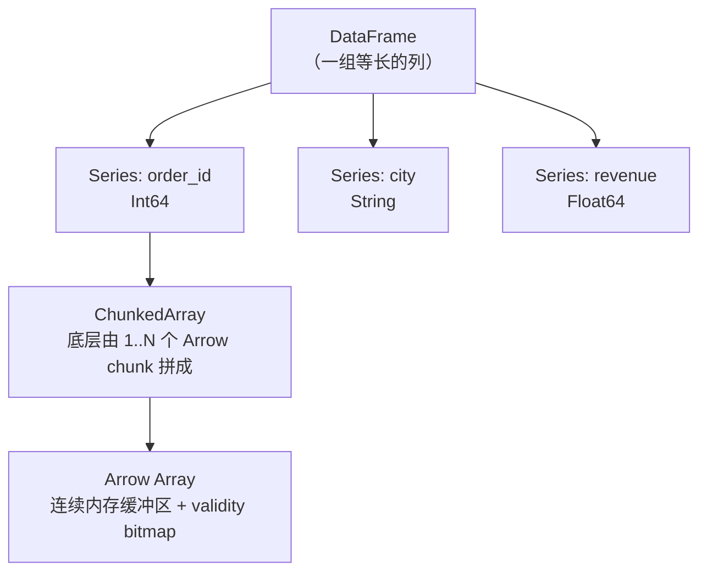
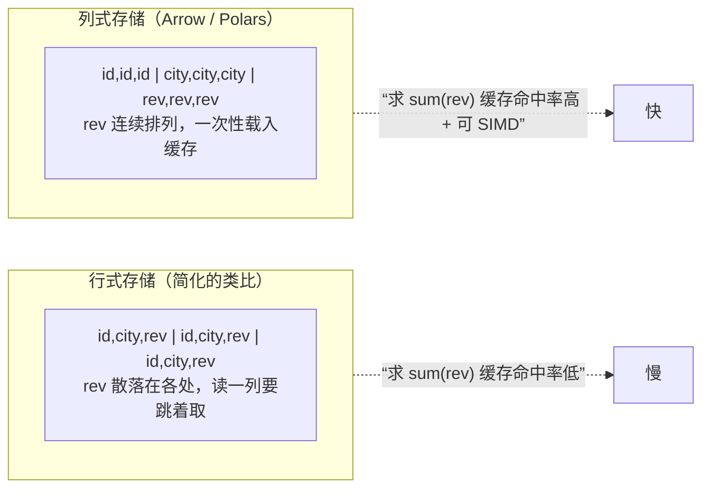
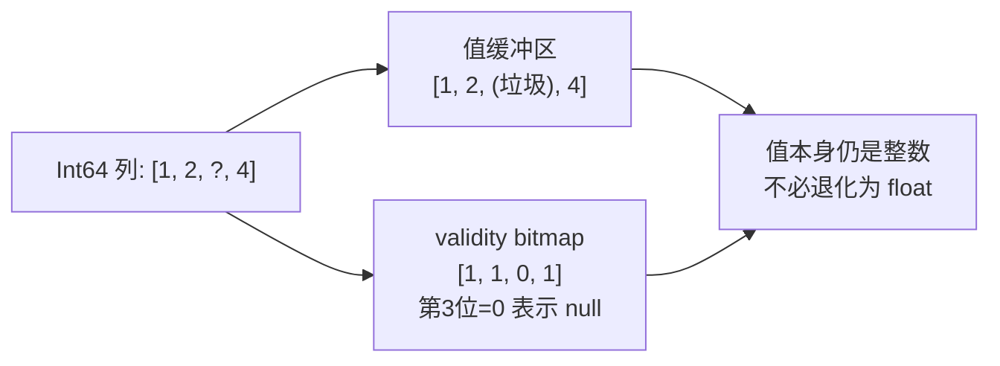

> 回指第 00 节的地图，这里是**地基层的第一块砖**。我们要把"DataFrame"这个词从"一张表"这种模糊印象，还原到**内存里一段连续字节**的物理真相。理解了这一层，后面"为什么快""为什么没有 index""null 和 NaN 为什么不同"全都迎刃而解。

---

## 心智模型：DataFrame 是"一组列"，不是"一堆行"

pandas 用户脑子里的 DataFrame 往往是"带行标签（index）的二维表"。Polars 要你换一个视角：

**Polars 的 DataFrame = 一个有序的 `Series` 集合，每个 `Series` 是一列，共享相同长度。**



- **Series**：一列同类型数据，是 Polars 的基本单位。
- **ChunkedArray**：Series 底层是"分块数组"——数据可能分成多个内存块（chunk）。`concat` 之类操作会增加 chunk 数，必要时用 `rechunk()` 合并成一块以提升后续访问速度。
- **Arrow Array**：每个 chunk 就是一段符合 Apache Arrow 规范的连续内存。

> 关键差异：**Polars 没有 index。** 没有 `df.loc[label]`，没有隐式的行标签对齐。行的身份就是它的位置（0, 1, 2...）。这是刻意的设计——index 是 pandas 大量隐式行为和 bug 的根源。

---

## 为什么"列式"是性能的起点

假设我们要算 `sum(revenue)`。看两种内存布局的差异：



当 `revenue` 在内存里严格连续排列时：
1. **CPU 缓存友好**：一次缓存行加载就能拿到多个 revenue 值。
2. **SIMD 向量化**：CPU 可用一条指令同时加多个 float。
3. **只读所需列**：算 revenue 时完全不碰 city/id 的内存（配合第 04 节的投影下推，甚至不从磁盘读它们）。

这就是第 00 节说的"快的第一个确定性原因"的物理基础。

---

## null vs NaN：一个必须现在就分清的坑

pandas 传统的 NumPy-backed dtype 长期用 `NaN`（浮点的"非数字"）同时表示"缺失"和"数学上的非数"，因此普通整数列一有缺失就会变成 float。现代 pandas 也提供 nullable `Int64`、Arrow-backed dtype 和 `pd.NA`；Polars 则从类型系统底层就借助 Arrow 的 **validity bitmap** 分开这两个概念：

| 概念 | 含义 | Polars 表示 | pandas 传统表示 |
| --- | --- | --- | --- |
| **null** | 值缺失（不知道/没有） | 独立的 validity bitmap 标记，任何类型都能有 null | 传统 NumPy dtype 常用 `NaN`；nullable dtype 使用 `pd.NA` |
| **NaN** | 浮点运算的非数结果（如 0/0） | 仅存在于浮点列的 `NaN` 值 | 浮点列仍可包含 `NaN`，`isna` 会同时识别多种缺失标记 |

- Polars 里 `Int64` 列可以带 null 而**不变成浮点**——因为缺失信息存在旁路的 bitmap 里，不占用值本身。
- 处理缺失用 `.is_null()` / `.fill_null()`；处理浮点非数用 `.is_nan()` / `.fill_nan()`。**两套 API，不要混用。**



---

## dtype 系统速览

Polars 的类型系统直接映射 Arrow 类型，比 pandas 更明确：

- **整数**：`Int8/16/32/64`、`UInt8/.../64`（缺失也不退化）。
- **浮点**：`Float32/64`。
- **布尔**：`Boolean`（1 bit 存储）。
- **字符串**：`String`（Arrow 兼容的变长 UTF-8，不是任意 Python 对象容器）。
- **时间**：`Date` / `Datetime`（带时间单位 ms/us/ns 和时区）/ `Duration` / `Time`。
- **类别**：`Categorical` / `Enum`（低基数字符串的高效编码）。
- **嵌套**：`List`（变长）/ `Array`（定长）/ `Struct`（命名字段）——第 08 节详解。

> 与传统 pandas `object` 字符串列相比，Polars 的 `String` 从一开始就是原生一等类型，字符串操作（第 08 节）可以直接走 Rust 的向量化路径。pandas 3 默认也会推断专用的 `str` dtype，因此迁移时应按**实际 dtype 和后端**比较，而不是把所有 pandas 字符串都视为 `object`。

---

## 配套代码在演示什么

`code/01_data_structures.py` 会带你逐一验证本节论点：

1. **构造 Series/DataFrame**，查看 `schema` 与 `dtypes`。
2. **测量内存**：用 `estimated_size()` 看列式存储的真实字节数。
3. **null vs NaN**：构造一个同时含 null 和 NaN 的浮点列，分别用两套 API 处理，看清区别。
4. **int 带 null 不退化**：证明 `Int64` 列有 null 仍是 `Int64`（对照 pandas 会变 float）。
5. **chunk 与 rechunk**：`concat` 后 `n_chunks` 增加，`rechunk()` 合并。
6. **与 Arrow 低成本互通**：`to_arrow()` / `from_arrow()` 对多数兼容类型可复用缓冲区；Categorical 等类型或需要重排数据时仍可能复制。
7. **没有 index**：展示 Polars 用位置而非标签定位行。

跑一遍：

```bash
uv run code/01_data_structures.py
```

---

## 本节要点回收

1. DataFrame 是**一组等长的 Series（列）**，Series 底层是 **ChunkedArray → Arrow Array**。
2. **列式 + 连续内存**是性能的物理起点（缓存 + SIMD + 只读所需列）。
3. **Polars 没有 index**，行的身份就是位置——这消除了 pandas 大量隐式对齐的坑。
4. **null（缺失，靠 bitmap）和 NaN（浮点非数）是两回事**，两套 API 不要混。
5. 整数列带 null **不会退化为 float**——Arrow bitmap 的直接红利。

下一节进入 Polars 的灵魂：**表达式系统**。这是你从"pandas 翻译腔"进化到"地道 Polars"的分水岭。
