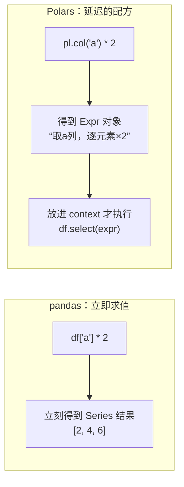
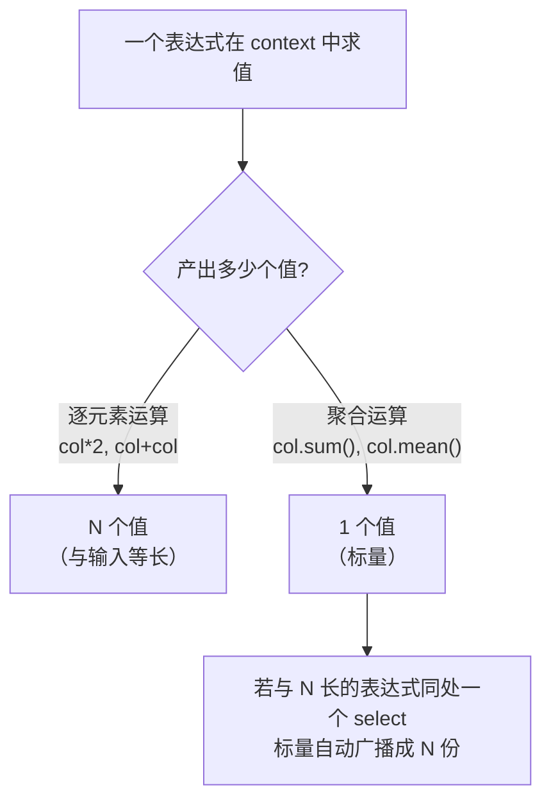

> 这是全书**最重要的一节**。如果说第 01 节讲的是"数据长什么样"，那么表达式（Expression）讲的是"你如何描述对数据的运算"。**不理解表达式，你写的永远是"pandas 翻译腔"的 Polars；理解了，你才真正拥有第 00 节所说的"Polars 手感"。**

---

## 心智模型：表达式是"运算的配方"，不是"运算的结果"

这是从 pandas 思维切换过来最大的一道坎。

在 pandas 里，`df['a'] * 2` **立即**算出一个新的 Series——它是**结果**。
在 Polars 里，`pl.col('a') * 2` **什么都没算**——它是一个**表达式对象**，是一张"配方"：描述"取 a 列，每个元素乘 2"这件事，但还没绑定到任何数据、还没执行。



这个"配方"的性质带来三个巨大好处，正是 Polars 强大的根源：

1. **可组合**：表达式能像乐高一样拼装。`(pl.col('a') * 2).sum()` 是"先乘 2 再求和"的配方。
2. **可复用**：一个表达式对象可以保存在变量中并在多处组合；`.alias()` 负责命名它的输出列。注意，同一个 `select` / `with_columns` 里的表达式并行基于**输入 schema**求值，不能直接引用同层刚创建的别名；有依赖关系时要复用原始 `Expr`，或拆成连续两次调用。
3. **可优化 & 可并行**：因为配方在执行前是"数据结构"而非"已发生的计算"，引擎能分析它、重排它、并行它（这正是第 04 节查询优化器的前提）。

> 一句话锚定：**pandas 操作的是数据，Polars 操作的是"对数据的描述"。**

---

## 表达式的四类起点

一个表达式总是从某个"源"开始，最常见的四种：

| 起点 | 含义 | 例子 |
| --- | --- | --- |
| `pl.col("x")` | 引用一列（或多列） | `pl.col("revenue")` |
| `pl.lit(v)` | 一个字面量常数 | `pl.lit(1)`、`pl.lit("web")` |
| `pl.col("*")` / selectors | 引用一组列 | `cs.numeric()` 选所有数值列 |
| 聚合/函数起点 | 直接产生值 | `pl.len()`、`pl.sum("x")` |

从起点出发，链式调用方法（`.sum()`、`.filter()`、`.str.to_uppercase()`...）不断"加工配方"，直到把它交给一个**上下文**（context，第 03 节）去求值。

---

## 表达式如何被"求值"：广播规则

表达式放进上下文后，会被求值成一列。它遵循一套**广播（broadcasting）规则**，理解它才能预测输出的行数：



- **逐元素表达式**（`pl.col('a') * 2`）：输出与输入等长。
- **聚合表达式**（`pl.col('a').sum()`）：输出一个标量。
- **混合时广播**：`pl.col('a') - pl.col('a').mean()`（每个值减去全列均值）——右边的标量被广播到每一行。这是"中心化"的地道写法，无需先算 mean 再手动相减。

---

## 条件逻辑：when / then / otherwise

Polars 没有 pandas 的 `np.where` / `np.select` 或 `.apply(lambda ...)`。条件运算用**表达式化**的 `when/then/otherwise` 链，它是向量化的、可优化的，且天然支持多分支：

```python
pl.when(pl.col("discount").is_null())
  .then(pl.lit("none"))
  .when(pl.col("discount") > 0.2)
  .then(pl.lit("high"))
  .otherwise(pl.lit("normal"))
  .alias("discount_level")
```

对照三方（按折扣分 none / high / normal 三档）：

| 工具 | 写法 | 特点 |
| --- | --- | --- |
| pandas | `np.select([c1, c2], ['none','high'], 'normal')` | 依赖 numpy，跳出了 DataFrame API |
| Polars | `pl.when(...).then(...).when(...).then(...).otherwise(...)` | 纯表达式，可链、可嵌套、可优化 |
| SQL | `CASE WHEN ... THEN 'none' WHEN ... THEN 'high' ELSE 'normal' END` | 声明式，语义等价 |

> 注意 Polars 的 when/then 是**表达式**，所以能嵌套、能和其他表达式组合，而不是一个特殊语法。这再次印证"一切皆表达式"的设计哲学。

---

## 为什么不要用 apply / map_elements

pandas 用户的肌肉记忆是 `.apply(lambda x: ...)`。在 Polars 里，`map_elements`（逐元素调用 Python 函数）是**最后手段**，因为：

- 它把数据从 Rust 拉回 Python 逐行处理，**丢掉了所有并行和向量化**，通常慢几十倍。
- 它对优化器是黑盒，无法下推、无法重排。

**正确姿势**：先问"能不能用内置表达式表达？"内置表达式覆盖面极广（数学、字符串、时间、列表、条件……）。真正需要自定义时，优先 `map_batches`（对整列批量操作）而非 `map_elements`（逐元素）。第 11 节会用 benchmark 量化这个差距。

---

## selectors：按"规则"选列

除了按名字 `pl.col("a", "b")`，Polars 提供 `polars.selectors`（惯例 `import polars.selectors as cs`）按类型/模式批量选列：

- `cs.numeric()`：所有数值列。
- `cs.string()`：所有字符串列。
- `cs.starts_with("order_")`：名字前缀匹配。
- `cs.contains("id")`：名字包含。

这让"对所有数值列求和""把所有字符串列转大写"这类操作一行搞定，且随数据 schema 变化自动适配。

---

## 配套代码在演示什么

`code/02_expressions.py` 用真实订单数据演示：

1. **表达式是对象**：打印一个未求值的 `Expr`，证明它只是"配方"。
2. **可复用**：定义一个 revenue 表达式，在 `select`、`filter`、`with_columns` 里反复使用。
3. **广播**：用 `col - col.mean()` 做中心化，看标量如何广播。
4. **when/then/otherwise**：给折扣分档（none/high/normal 三档），并与 pandas `np.select`、DuckDB `CASE WHEN` 三方对照。
5. **表达式组合**：把多个表达式拼成一个复杂配方。
6. **selectors**：对所有数值列一次性聚合。
7. **map_elements vs 原生表达式**：直观感受"翻译腔"和"地道写法"的差异。

```bash
uv run code/02_expressions.py
```

---

## 本节要点回收

1. 表达式是**运算的配方（Expr 对象）**，不是结果——这是 Polars 与 pandas 的根本分野。
2. 表达式的三大红利：**可组合、可复用、可优化并行**。
3. 广播规则：逐元素表达式产出 N 值，聚合产出标量，混用时标量广播。
4. 条件逻辑用 **when/then/otherwise**（向量化），对标 SQL 的 `CASE WHEN`。
5. **远离 apply/map_elements**，优先内置表达式；必要时用 `map_batches`。
6. 用 **selectors** 按规则批量选列。

下一节讲这些表达式到底在"哪里"被求值——四大上下文（Contexts）。表达式 + 上下文，构成 Polars 的完整语法骨架。
