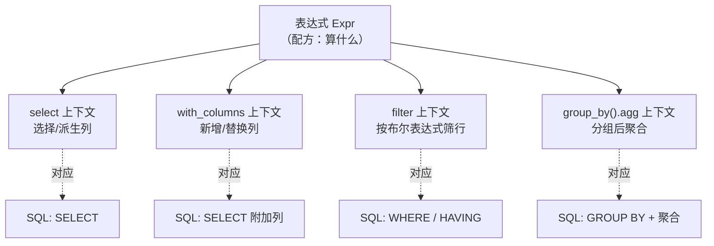
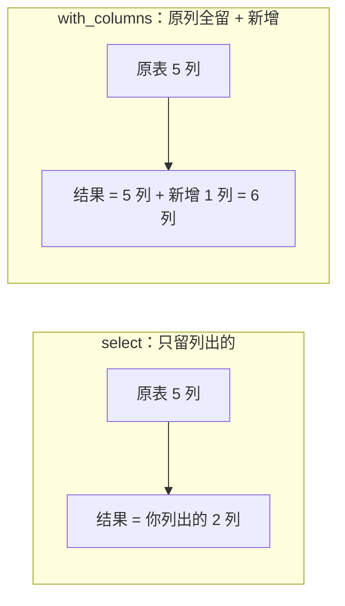
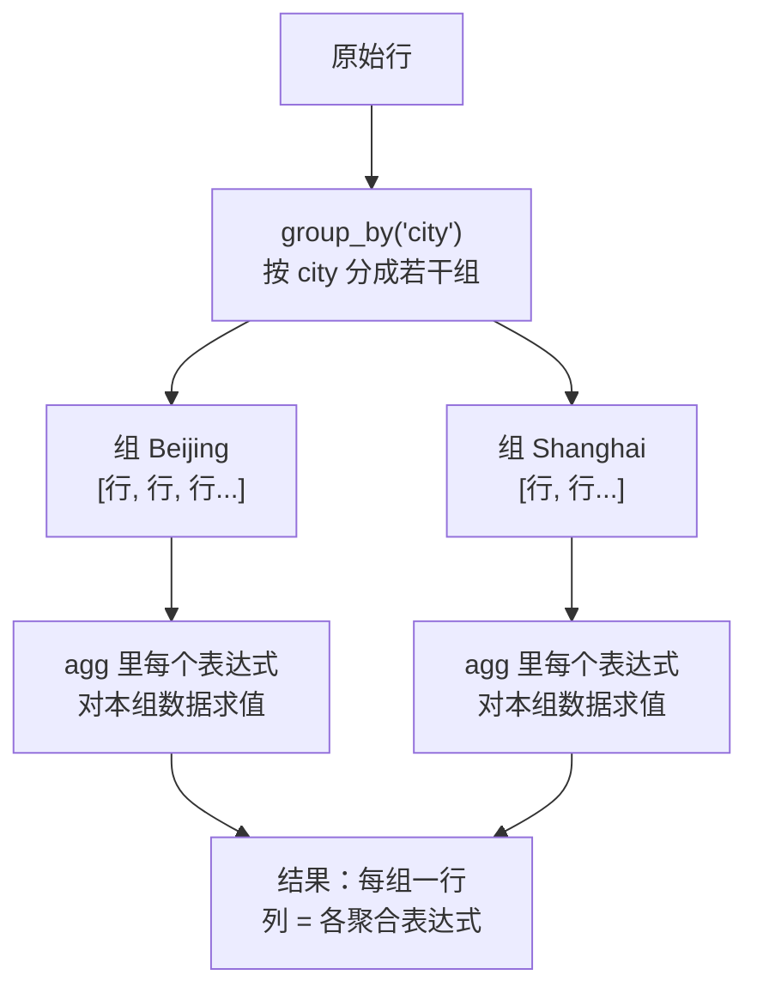

> 第 02 节说表达式是"配方"。那配方在哪儿下锅？答案是**上下文（Context）**。表达式 + 上下文，构成 Polars 完整的语法骨架：**表达式描述"算什么"，上下文决定"在什么语义下算、产出什么形状"。** 同一个表达式，放进不同上下文，行为不同。

---

## 心智模型：上下文是表达式的"求值环境"

回顾第 00 节的对照：SQL 的一条查询由 `SELECT ... WHERE ... GROUP BY ...` 这些子句构成。Polars 的上下文几乎一一对应这些子句——它们就是表达式的"执行插槽"。



四大上下文就是你 90% 时间在用的东西。掌握"哪个表达式该放进哪个上下文"，你就会写 Polars 了。

---

## 上下文一：`select` —— 选择与派生

`select` 产出一个**新 DataFrame，只包含你在括号里列出的表达式结果**。它像 SQL 的 `SELECT`：

```python
df.select(
    pl.col("order_id"),                          # 原样保留
    (pl.col("unit_price") * pl.col("quantity")).alias("gross"),  # 派生新列
    pl.col("discount").mean().alias("avg_disc"), # 聚合成标量（会广播）
)
```

- 输出的列 = 你列出的表达式，其他列被丢弃。
- 可混合"逐元素"和"聚合"表达式——聚合结果广播到与最长列等长（第 02 节的广播规则）。

> 关键差异 vs pandas：pandas 的 `df[['a','b']]` 只能选已有列，派生要另起一行赋值。Polars 的 `select` 里**选择和计算是同一件事**。

---

## 上下文二：`with_columns` —— 新增/替换列

`with_columns` 和 `select` 的唯一区别：**它保留所有原列，把表达式结果作为新列追加（或按同名替换）**。



选择依据很简单：
- 想**收窄**成几列 / 做聚合汇总 → `select`。
- 想在**保留全表**的基础上加工出新列 → `with_columns`。

同名列会被**替换**，这是原地修改列的地道方式（Polars 没有 pandas 的 `inplace=True`，一切返回新对象）。

---

## 上下文三：`filter` —— 按布尔表达式筛行

`filter` 接收一个**求值为布尔列**的表达式，保留为 `True` 的行：

```python
df.filter(
    (pl.col("discount") > 0.1) & (pl.col("channel") == "web")
)
```

- 多条件用 `&`（与）、`|`（或）、`~`（非），**每个条件必须用括号包住**（Python 运算符优先级所致）。
- 对标 SQL 的 `WHERE`。分组后的过滤（SQL 的 `HAVING`）在 Polars 里就是对 `agg` 结果再 `.filter()`。

> 对照 pandas：pandas 的 `df[df.a > 1]` 用布尔索引，且容易触发 `SettingWithCopyWarning`。Polars 的 `filter` 是纯函数式，无此类隐患。

---

## 上下文四：`group_by().agg` —— 分组聚合

这是最能体现"表达式威力"的上下文。`group_by` 定义分组键，`agg` 里的**每个表达式对"每个组内的数据"求值**：

```python
df.group_by("city").agg(
    pl.len().alias("n_orders"),               # 每组行数
    pl.col("revenue").sum().alias("total"),   # 每组求和
    pl.col("revenue").mean().alias("avg"),    # 每组均值
    (pl.col("revenue") > 100).sum().alias("n_big"),  # 每组内满足条件的计数
)
```



**精髓**：`agg` 里可以放**任意复杂的表达式**，不只是 `sum`/`mean`。比如 `pl.col("x").filter(pl.col("y") > 0).sum()`（组内先过滤再求和）、`pl.col("x").sort_by("ts").last()`（组内按时间取最后一个）。这远超 SQL 聚合函数的表达力，也是第 05 节的主题。

---

## 上下文的组合：链式管道

真实代码是这些上下文的链式组合，读起来像一条清晰的数据管道：

```python
(
    df
    .filter(pl.col("discount").is_not_null())     # 先筛
    .with_columns(revenue_expr)                   # 再派生
    .group_by("city")                             # 分组
    .agg(pl.col("revenue").sum())                 # 聚合
    .sort("revenue", descending=True)             # 排序
)
```

对照 SQL，这条链几乎逐句对应 `WHERE → SELECT → GROUP BY → ORDER BY`。差别是：Polars 的顺序是你写的顺序（命令式的可读性），但在 Lazy 模式下优化器会重排它（声明式的性能）——又一次"手感 + 大脑"。

---

## 配套代码在演示什么

`code/03_contexts.py`：

1. `select`：选择 + 派生 + 聚合广播三合一。
2. `with_columns`：保留全表加新列，以及同名替换。
3. `filter`：多条件组合，对照 SQL `WHERE`。
4. `group_by().agg`：从简单聚合到"组内过滤再聚合"的高级表达式。
5. 四个上下文串成一条完整管道，并与等价 SQL 三方对照。

```bash
uv run code/03_contexts.py
```

---

## 本节要点回收

1. **表达式 + 上下文 = Polars 语法骨架**：表达式管"算什么"，上下文管"什么语义、什么形状"。
2. 四大上下文对应 SQL 子句：`select`→SELECT，`with_columns`→加列，`filter`→WHERE，`group_by().agg`→GROUP BY。
3. `select`（收窄/汇总）与 `with_columns`（保全表+加列）的取舍是日常最高频的选择。
4. `filter` 多条件记得**每个条件加括号**。
5. `agg` 里能放**任意复杂表达式**，这是 Polars 表达力远超 SQL 聚合的地方。

下一节我们揭开 Polars 的"大脑"——Lazy API 与查询优化器，看这些上下文链在执行前如何被智能重排。
