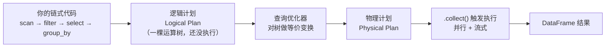
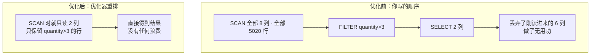

> 第 00 节说 Polars 是"pandas 的手感 + DuckDB 的大脑"。前三节都在讲"手感"（数据结构、表达式、上下文）。**这一节讲"大脑"**——Lazy API 与查询优化器。这是 Polars 相对 pandas 最"降维打击"的地方，也是你把探索代码升级为生产管道时收益最大的一环。

---

## 心智模型：先"编译"，后"执行"

Eager 模式（前三节一直在用）像**解释型脚本**：读一行、执行一行，引擎没有全局视野。

Lazy 模式像**编译型语言**：你写的一整段链式调用先被收集成一个**逻辑计划（query plan）**，等你调用 `.collect()` 时，优化器先把这张计划"编译优化"一遍，再交给执行引擎。



关键：从 `scan_*` 到 `.collect()` 之间，**没有任何数据被真正处理**。你在搭一张蓝图。这就是"惰性（lazy）"。

---

## 入口与出口

| | Eager | Lazy |
| --- | --- | --- |
| **读数据** | `pl.read_parquet(...)` | `pl.scan_parquet(...)` |
| **已有 df 转换** | —— | `df.lazy()` |
| **触发执行** | 自动（每步） | `.collect()` |
| **看计划** | —— | `.explain()` |
| **返回类型** | `DataFrame` | `LazyFrame` → collect 后是 `DataFrame` |

记住这对"孪生动词"：`read_*`（急切、立即加载）vs `scan_*`（惰性、只登记来源）。生产代码优先 `scan_*`。

---

## 优化器做了什么：用 explain() 亲眼看

优化器的价值不是抽象口号，可以用 `explain()` 打印出来。看这段代码：

```python
pl.scan_parquet("orders.parquet")
  .filter(pl.col("quantity") > 3)
  .select("order_id", "quantity")
```

**未优化的逻辑计划**（`explain(optimized=False)`）忠实反映你写的顺序：

```
SELECT [col("order_id"), col("quantity")]
  FILTER col("quantity") > 3
    Parquet SCAN [orders.parquet]
    PROJECT */8 COLUMNS          ← 打算读全部 8 列
```

**优化后的计划**（`explain()`）被压扁成一步：

```
Parquet SCAN [orders.parquet]
PROJECT 2/8 COLUMNS              ← 只读 2 列！（投影下推）
SELECTION: col("quantity") > 3  ← 过滤下推到扫描时（谓词下推）
```

优化器把 filter 和 select **推到了数据源扫描阶段**：读 Parquet 时就只解码 2 列、只保留满足条件的行。**能少读的绝不多读。**



---

## 优化器的核心武器

Polars 优化器包含一系列经典的数据库优化规则，最重要的几个：

| 优化 | 做什么 | 收益 |
| --- | --- | --- |
| **投影下推 Projection Pushdown** | 只读/只保留后续真正用到的列 | 少读列 = 少 IO、少内存 |
| **谓词下推 Predicate Pushdown** | 把过滤条件尽量推到数据源 | 少读行 = 越早过滤越省 |
| **切片下推 Slice Pushdown** | `head(n)` 时只物化 n 行 | 大表取前几行几乎零成本 |
| **公共子表达式消除 CSE** | 重复的子表达式只算一次 | 省重复计算 |
| **谓词/投影合并** | 相邻操作融合 | 减少中间物化 |

这些优化对 Eager 模式**不生效**——因为 Eager 每步立即执行，优化器根本没机会看到"后面还要 filter"。这就是为什么"探索用 Eager、生产用 Lazy"。

---

## 与 SQL 优化器的血缘

如果你熟悉数据库，会发现 Polars 的逻辑计划/物理计划、下推优化，和 SQL 引擎（如 DuckDB）的查询优化几乎是同一套理论。区别在于：

- **SQL**：你写声明式 SQL，优化器是唯一路径，你无法干预中间步骤。
- **Polars Lazy**：你用 Python 表达式"描述"计划（可断点、可拆分、可单测），优化器同样介入。**你获得了 SQL 级的优化，却保留了通用语言的灵活。**

这正是第 00 节"手感 + 大脑"的技术兑现。第 11 节会用 benchmark 展示 Lazy 相对 Eager/pandas 的真实性能差距。

---

## 什么时候必须用 Lazy

- **数据接近或超过内存**：配合 streaming（第 10 节），`scan_* + collect(engine="streaming")` 能处理比内存大的数据。
- **多步管道 + 只要部分结果**：优化器帮你砍掉无用的读取和计算。
- **从文件读取的生产 ETL**：`scan_parquet/scan_csv` 让下推优化直达存储层。

**什么时候留在 Eager**：交互式探索、需要频繁 `print` 中间结果调试、数据很小。

---

## 配套代码在演示什么

`code/04_lazy_optimizer.py`：

1. **scan vs read**：构造同一查询的 Lazy 与 Eager 版本，看返回类型差异。
2. **explain 对照**：打印同一查询"优化前 vs 优化后"的计划，亲眼看到投影下推、谓词下推。
3. **投影下推证据**：`PROJECT 2/8 COLUMNS` —— 只读了用到的列。
4. **谓词下推证据**：`SELECTION` 出现在 SCAN 层。
5. **collect 触发执行**：验证 LazyFrame 在 collect 前不产出数据。
6. **切片下推**：`head` 如何被下推。

```bash
uv run code/04_lazy_optimizer.py
```

---

## 本节要点回收

1. Lazy = **先编译（搭计划）后执行（collect）**；Eager = 解释执行（每步立即）。
2. 入口 `scan_*`，出口 `.collect()`，看计划 `.explain()`。
3. 优化器核心武器：**投影下推、谓词下推、切片下推、CSE**——能少读绝不多读。
4. 这些优化**只在 Lazy 生效**，Eager 无全局视野。
5. Polars Lazy = **SQL 级优化 + 通用语言的灵活**，是"大脑"的技术兑现。

下一节回到"操作层"，用 Lazy/Eager 都适用的方式深入聚合、分组与窗口函数。
