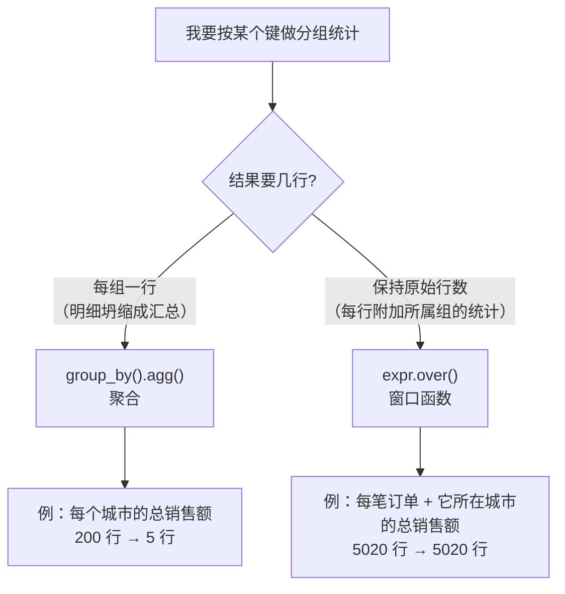
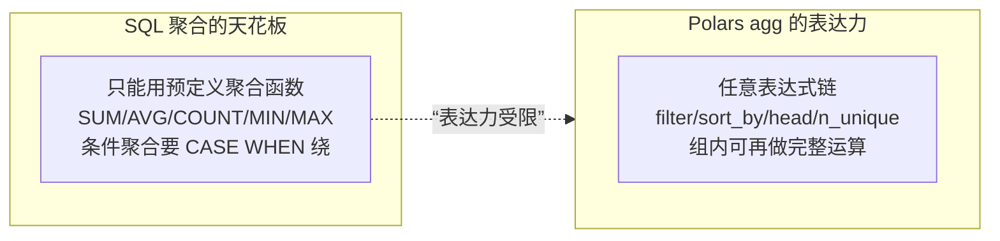

> 进入"操作层"。这是日常数据分析最高频的场景：**把多行数据压缩成汇总（聚合），或在保持明细的同时附加分组统计（窗口）。** Polars 在这里的表达力显著超过 SQL 聚合函数——因为第 02 节的"任意表达式"能力，在 `agg` 里被完全释放。

---

## 心智模型：两种"分组后"的形状

分组之后，你想要的结果只有两种形状。想清楚要哪种，就知道用哪个 API：



- **`group_by().agg()`**：N 行 → 组数行。明细被"压扁"成汇总。对应 SQL `GROUP BY`。
- **`expr.over()`**：N 行 → N 行。每行附加"它所属组"的统计值。对应 SQL 窗口函数 `OVER (PARTITION BY ...)`。

**这是本节最重要的分叉。** 想要报表汇总用 `agg`；想给明细打标（如"该订单占本城市销售额的比例"）用 `over`。

---

## group_by().agg：聚合的表达力

回顾第 03 节：`agg` 里的每个表达式对"每个组内的数据"求值。Polars 的杀手锏是——**agg 里能放任意复杂表达式**，不局限于 `sum`/`count`：

```python
df.group_by("city").agg(
    pl.len().alias("n"),                                   # 组内行数
    pl.col("revenue").sum().alias("total"),                # 常规聚合
    pl.col("revenue").filter(pl.col("channel")=="web").sum().alias("web_rev"),  # 组内过滤再聚合
    pl.col("product_id").n_unique().alias("n_products"),   # 组内去重计数
    pl.col("revenue").sort_by("order_ts").last().alias("latest_rev"),  # 组内按时间取最后一单
    pl.col("revenue").quantile(0.5).alias("median"),       # 组内中位数
)
```

对照 SQL，`web_rev` 那种"组内先按条件过滤再聚合"在 SQL 里得写 `SUM(CASE WHEN channel='web' THEN revenue END)`，而 `latest_rev` 那种"按另一列排序取最后"在标准 SQL 聚合里几乎无法直接表达（要靠窗口函数绕）。Polars 里它们都只是普通表达式。



---

## 窗口函数 over：保持明细 + 附加分组统计

`over` 是"分组统计但不坍缩行数"。经典用途：

```python
df.with_columns(
    # 每笔订单所在城市的总销售额（广播回每一行）
    pl.col("revenue").sum().over("city").alias("city_total"),
    # 每笔订单在其城市内按销售额的排名
    # 用 "ordinal" 得到严格的 1,2,3…（默认 "average" 在并列时返回 1.5，
    # 且列类型是 Float64；若后续要按 == 1 取 Top，会漏掉并列的第一名）
    pl.col("revenue").rank("ordinal", descending=True).over("city").alias("rank_in_city"),
    # 每笔订单占其城市销售额的比例
    (pl.col("revenue") / pl.col("revenue").sum().over("city")).alias("share"),
)
```


- `over` 后行数不变，聚合值被广播回组内每一行。
- 可以 `over` 多个键：`.over(["city", "channel"])`。
- 结合 `sort_by` 能做组内有序计算（如组内累计和 `cum_sum`）。

**何时用 over 而非 agg + join**：如果你发现自己"先 group_by 算汇总，再 join 回原表"，几乎总能用一个 `over` 一步搞定，更快也更清晰。

---

## 三方对照：同一任务的三种表达

任务：**每个城市的订单数与总销售额**。

| 工具 | 写法 | 说明 |
| --- | --- | --- |
| pandas | `df.groupby('city').agg(n=('id','size'), total=('rev','sum'))` | 命名聚合，语法略绕 |
| Polars | `df.group_by('city').agg(pl.len(), pl.col('rev').sum())` | 表达式，可任意扩展 |
| SQL | `SELECT city, COUNT(*), SUM(rev) FROM t GROUP BY city` | 声明式基准 |

任务：**每笔订单占其城市销售额的比例**（窗口）。

| 工具 | 写法 |
| --- | --- |
| pandas | `df['share'] = df['rev'] / df.groupby('city')['rev'].transform('sum')` |
| Polars | `(pl.col('rev') / pl.col('rev').sum().over('city'))` |
| SQL | `rev / SUM(rev) OVER (PARTITION BY city)` |

注意 pandas 的 `transform('sum')` 正是 Polars `over` 的对应物——它们都是"不坍缩行数的分组聚合"。

---

## 配套代码在演示什么

`code/05_aggregation.py`：

1. **基础 agg**：多个聚合表达式一次算完，三方对照。
2. **高级 agg**：组内过滤聚合、组内去重计数、组内按时间取值、分位数。
3. **over 窗口**：城市总额、组内排名、组内占比。
4. **over vs agg+join**：证明 `over` 一步等价于"agg 再 join 回去"。
5. **多键分组**：`group_by(["city","channel"])`。

```bash
uv run code/05_aggregation.py
```

---

## 本节要点回收

1. 分组后两种形状：**`agg`（坍缩成每组一行）vs `over`（保持明细、附加组统计）**。
2. `agg` 里能放**任意表达式**（组内过滤/排序/去重/分位数），表达力远超 SQL 聚合函数。
3. `over` 对应 SQL 窗口函数、pandas 的 `transform`，适合算占比/组内排名/组内累计。
4. 看到"group_by 汇总再 join 回原表"，改用一个 `over` 更优。

下一节讲如何把多张表拼起来——连接 Join 与拼接。
