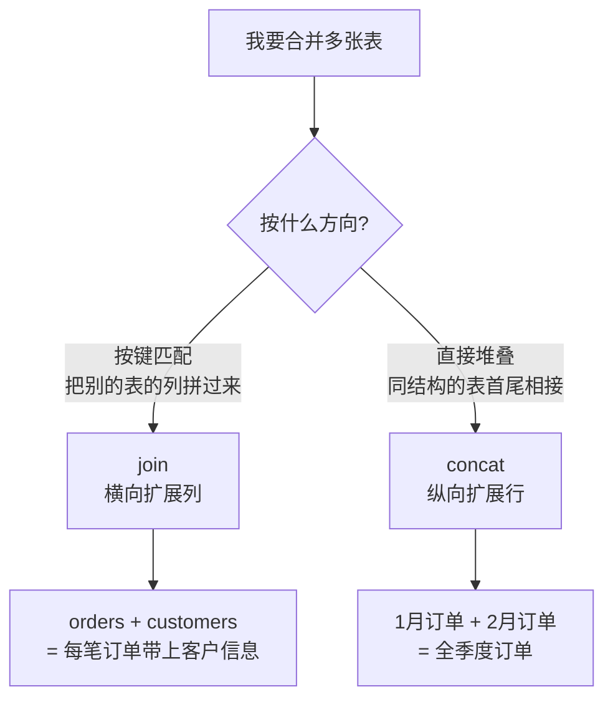

> 真实数据总是散落在多张表里（回顾我们的星型模型：orders / customers / products）。这一节讲如何把它们拼起来——横向的 **join**（按键匹配列）和纵向的 **concat**（堆叠行/列）。Polars 的 join 语义总体贴近 SQL，但有几个"默认行为"的坑（尤其是 null 键，第 05 节已埋伏笔）必须讲清。

---

## 心智模型：横向拼 vs 纵向拼



- **join**：按一个/多个"键"列匹配，把右表的列拼到左表。这是关系型数据的核心操作。
- **concat**：把结构相同的多张表首尾相接（纵向）或并排（横向），不涉及键匹配。

---

## join 的 how：五种匹配策略

`df.join(other, on="key", how=...)` 的 `how` 决定"匹配不上的行怎么办"：

```mermaid
graph TD
    subgraph 保留行的策略
        I["inner（默认）<br/>只保留两边都匹配的行"]
        L["left<br/>保留左表全部，右表缺失填 null"]
        F["full<br/>保留两边全部，各自缺失填 null"]
    end
    subgraph 过滤型（只用右表做筛选，不加列）
        SE["semi<br/>保留左表中'能在右表找到'的行"]
        AN["anti<br/>保留左表中'在右表找不到'的行"]
    end
```

| how | 语义 | 典型用途 | SQL 对应 |
| --- | --- | --- | --- |
| `inner` | 两边都有键才保留 | 订单 × 商品（只要有效订单） | `INNER JOIN` |
| `left` | 左表全留，右表补 null | 订单为主，补充客户信息（哪怕客户缺失） | `LEFT JOIN` |
| `full` | 两边全留 | 对账：找出两边各自独有的键 | `FULL OUTER JOIN` |
| `semi` | 左表中能匹配的行（**不加右表列**） | "有过下单的客户"——筛选而非扩展 | `WHERE k IN (SELECT ...)` |
| `anti` | 左表中匹配不上的行（**不加右表列**） | "从未下单的客户"——找缺口 | `WHERE NOT EXISTS (...)` |

> **semi/anti 是 Polars 相对 pandas 的一大便利**。pandas 里要实现"从未下单的客户"得用 `isin` + 取反的迂回写法；Polars 一个 `how="anti"` 直达。它们本质是"用右表当过滤器"，结果只含左表的列。

---

## 三个必须知道的默认行为

### 坑一：null 键默认不匹配

这是第 05 节我们撞到的真实坑。`join` 默认 `nulls_equal=False`——**两边的 null 键不会互相匹配**（符合 SQL 里 `NULL != NULL` 的语义）。

后果取决于 join 类型：`inner` 会丢掉没有匹配项的 null 键行；`left` 仍保留左表的 null 键行，只是右表列填 null；`full` 会把两侧未匹配的 null 各自保留下来。要让两侧 null **互相匹配**，显式传 `nulls_equal=True`。

```python
# 默认 inner：左侧 null 没有匹配项，因此对应行被丢弃
df.join(other, on="city", how="inner")

# left 始终保留左表行；nulls_equal 只决定右表 null 是否与它匹配
df.join(other, on="city", how="left")
df.join(other, on="city", how="left", nulls_equal=True)
```

这也是为什么 anti join 更接近 SQL 的 `NOT EXISTS`，而不是 `NOT IN`：后者只要右侧结果里出现 null，就会受到 SQL 三值逻辑影响，可能得不到直觉中的"未匹配行"。

### 坑二：join 会放大行数（多对多）

如果键在右表不唯一，一行左表会匹配出多行——结果行数**膨胀**。维度表（customers/products）的键通常唯一所以安全，但 join 两张事实表时务必警惕。用 `validate="1:1"` / `"1:m"` / `"m:1"` 让 Polars 帮你校验基数假设，不符就报错。

### 坑三：重名列的后缀

两表有同名非键列时，右表的列会自动加 `_right` 后缀（可用 `suffix=` 自定义）。

---

## join_asof：时间序列的"最近匹配"

普通 join 要求键**精确相等**。但时间序列里常需要"最近的、不超过某时刻的那条记录"——比如给每笔交易匹配"下单那一刻最新的报价"。这就是 `join_asof`：


- `strategy="backward"`（默认）：匹配 ≤ 当前键的最近一条。
- `strategy="forward"`：匹配 ≥ 当前键的最近一条。
- `strategy="nearest"`：匹配绝对距离最近的一条。
- 前提：两表都按 as-of 键**有序**。可配合 `by=` 先分组再各组内 as-of（如按股票代码分别匹配报价）。

这是金融/IoT 场景的利器，pandas 有 `merge_asof` 对应，标准 SQL 则相当笨拙。

---

## concat：纵向/横向堆叠

```python
pl.concat([df1, df2], how="vertical")    # 纵向：行首尾相接（默认，要求列一致）
pl.concat([df1, df2], how="horizontal")  # 横向：列并排（要求行数一致）
pl.concat([df1, df2], how="diagonal")    # 对角：列不完全一致时，缺列补 null
```

- `vertical`：最常见，合并同结构的分片数据（如按月的文件）。列名/类型需一致。
- `diagonal`：列集合不同也能合并，取并集、缺失补 null——处理"schema 略有差异的多批数据"很实用。
- `horizontal`：按位置并排，罕用（通常该用 join）。

---

## 配套代码在演示什么

`code/06_joins.py`：

1. **五种 how**：inner/left/full/semi/anti，用订单与客户表演示，三方对照 SQL。
2. **anti 的实战**：找出"从未下单的客户"。
3. **null 键的坑**：复现第 05 节的行数差异，展示 `nulls_equal` 的开关效果。
4. **validate 基数校验**：故意用会失败的校验，展示它如何保护你。
5. **join_asof**：给交易匹配最近报价，演示 backward/forward。
6. **concat**：vertical 与 diagonal 的差异。

```bash
uv run code/06_joins.py
```

---

## 本节要点回收

1. **join（横向按键）vs concat（纵向堆叠）** 是两个方向的合并。
2. 五种 how：inner/left/full 扩展列，**semi/anti 只用右表做过滤**（Polars 的便利）。
3. 三大默认坑：**null 键不匹配（nulls_equal）、多对多放大行数（validate）、重名列后缀**。
4. **join_asof** 做时间序列的最近匹配，金融/IoT 利器。
5. concat 的 **diagonal** 模式能优雅处理 schema 略有差异的多批数据。

下一节讲改变表的"形状"——数据重塑 pivot / melt。
