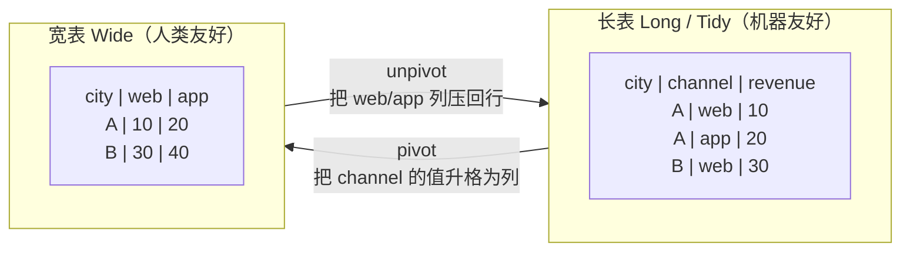
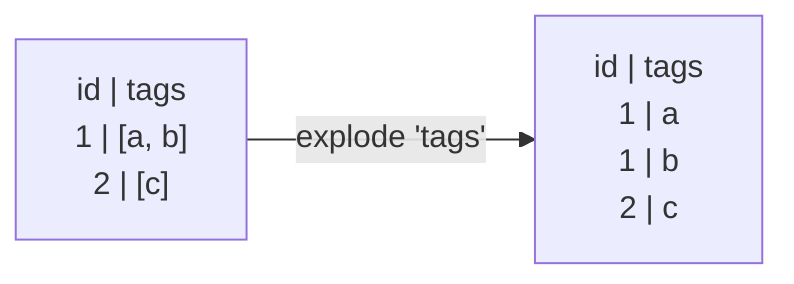

> 前面几节改变的是表的"内容"（筛选、聚合、连接）。这一节改变表的**形状**——在"长表"和"宽表"之间转换，以及把嵌套的 list 列"炸开"成多行。想清楚"长 vs 宽"的心智模型，你就掌握了数据分析里最让人困惑的一类操作。

---

## 心智模型：长表 vs 宽表

同一份数据有两种排布方式，理解它们的互换是重塑的核心：



- **长表（Long / Tidy）**：每行是一个"观测"，变量名在列里、变量值在另一列。**利于聚合、绘图、存储**——是数据处理的推荐中间态。
- **宽表（Wide）**：把某个分类变量的每个取值摊成独立的列。**利于人眼阅读、做交叉报表**（如 Excel 透视表）。

`pivot`（长→宽）和 `unpivot`（宽→长）方向相反，但不一定可逆：一旦 `pivot` 使用聚合把多行压成一个单元格，原始明细就无法由 `unpivot` 恢复。只有每个 `(index, on)` 组合本来就唯一、且没有丢弃其他列时，往返才可能保留原信息。

> 记忆法：**pivot 让表变胖（列变多），unpivot 让表变高（行变多）。**

---

## pivot：长表 → 宽表

`pivot` 把某列的**值**提升为新的**列名**：

```python
df.pivot(
    on="channel",       # 这列的每个唯一值 → 一个新列（web, app, store）
    index="city",       # 保持为行标识的列
    values="revenue",   # 填充到新列里的值
    aggregate_function="sum",  # 同一格有多个值时如何聚合
)
```

- `on`：要"摊开"的分类列。它有几个唯一值，就生成几个新列。
- `index`：作为行标识保留的列。
- `values`：填进矩阵的数值列。
- `aggregate_function`：因为 (index, on) 的组合可能对应多行原始数据，必须指定如何把它们聚合成一个值（`sum`/`mean`/`first`...）。

> 对照：pandas 的 `pivot_table`、SQL 里没有标准 PIVOT（需手写 `SUM(CASE WHEN channel='web' THEN rev END)` 那种条件聚合，非常繁琐）。这是 Polars/pandas 相对 SQL 明显更方便的场景。

---

## unpivot：宽表 → 长表

`unpivot`（旧名 `melt`，Polars 已更名）是逆操作，把多个列"折叠"成"变量名 + 值"两列：

```python
wide.unpivot(
    index="city",                 # 保持不动的标识列
    on=["web", "app", "store"],   # 要折叠的列（不指定则为 index 之外的全部）
    variable_name="channel",      # 存放"原列名"的新列名
    value_name="revenue",         # 存放"原列值"的新列名
)
```

为什么常常需要 unpivot？因为外部数据（尤其是人工维护的 Excel）往往是宽表，而聚合和可视化工具偏爱长表。**"读进来先 unpivot 成长表"是常见的清洗第一步。**

---

## explode：把 list 列"炸开"成多行

当一列的每个单元格是一个 list（第 08 节会详谈 List 类型），`explode` 把它展开——list 里每个元素变成独立一行，其他列的值随之复制：



典型场景：一个订单含多个商品（`items: [x, y, z]`），explode 后每个商品一行，便于逐项统计。它是 `group_by(...).agg(pl.col(...))`（把多行收拢成 list）的逆操作——这对"收拢/炸开"在处理嵌套数据时反复出现。

---

## 相关操作：transpose 与 partition_by

- **`transpose`**：行列互换（真正的矩阵转置），少用但偶尔需要（如把一行指标转成一列）。
- **`partition_by`**：按键把一个 DataFrame **物理拆分成多个 DataFrame**（返回 list 或 dict），适合"分组后分别导出/分别处理"的场景，区别于 `group_by`（聚合成一张表）。

---

## 配套代码在演示什么

`code/07_reshape.py`：

1. **pivot**：把订单按 (city × channel) 做成销售额矩阵，对照 pandas `pivot_table`。
2. **pivot → unpivot 往返**：展示聚合后的宽表可折回聚合粒度的长表，但不能恢复订单明细。
3. **unpivot 实战**：模拟一个宽表外部数据，unpivot 成长表再聚合。
4. **explode**：把"每个客户的商品列表"炸开成逐条明细。
5. **group_by agg ↔ explode**：展示"收拢成 list"与"炸开"的互逆关系。
6. **partition_by**：按渠道拆成多个独立 DataFrame。

```bash
uv run code/07_reshape.py
```

---

## 本节要点回收

1. **长表（利于机器/聚合）vs 宽表（利于人眼/报表）** 是重塑的核心心智模型。
2. **pivot 让表变胖**（长→宽，值升格为列名）；需要聚合时会丢失明细，之后 unpivot 也无法恢复。
3. **unpivot 让表变高**（宽→长，"读进来先 unpivot"是常见清洗第一步）。
4. **explode 炸开 list 列**，是 `agg(pl.col(...))` 收拢的逆操作。
5. pivot 在 SQL 里很繁琐，是 Polars/pandas 的优势场景；`partition_by` 用于物理拆表。

下一节深入 Polars 的复杂类型——字符串、List、Struct，以及它们各自的表达式命名空间。
