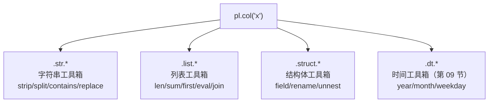
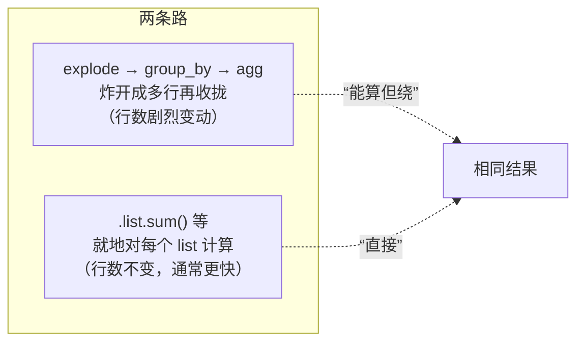
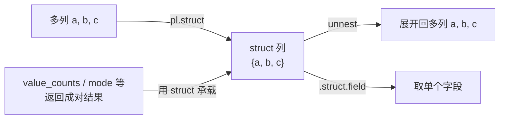

> 到目前为止我们处理的都是"标量列"（一格一个数/字符串）。真实数据里还有大量**复杂类型**：需要清洗的脏字符串、一格装多个值的 List、一格装一个"对象"的 Struct。Polars 用**命名空间（namespace）**优雅地组织这些类型的专属操作——这是它相对 pandas `object` 列一团乱麻的巨大改进。

---

## 心智模型：命名空间 = 类型专属的工具箱

Polars 把"只对某类型有意义"的操作，收进以 `.` 分隔的命名空间里。你在表达式后面接 `.str` / `.list` / `.struct` / `.dt`，就打开了对应类型的工具箱：



好处：**发现性强**（IDE 里敲 `.str.` 就列出所有字符串操作）、**类型安全**（对字符串列用 `.list` 会报错）、**全部向量化**（走 Rust 路径，不像 pandas `.str` 那样慢）。

---

## String 命名空间：`.str`

pandas 的字符串列常是 `object` 类型，操作慢且行为不一致。Polars 的 `String` 是原生类型，`.str` 下的操作全部向量化：

| 常用操作 | 作用 |
| --- | --- |
| `.str.strip_chars()` | 去首尾空白（清洗脏数据必备） |
| `.str.to_lowercase()` / `to_uppercase()` | 大小写转换 |
| `.str.contains(pat)` | 是否匹配（支持正则） |
| `.str.replace()` / `replace_all()` | 替换（支持正则） |
| `.str.split(by)` | 拆成 List 列 |
| `.str.slice(start, len)` | 子串 |
| `.str.len_chars()` / `len_bytes()` | 长度 |
| `.str.extract(pat, group)` | 正则提取捕获组 |

我们的数据里 `note` 列就是脏的（`" OK "`、`"gift "`、大小写混乱）。清洗它的地道写法：

```python
pl.col("note").str.strip_chars().str.to_lowercase()
```

对照三方：pandas `df['note'].str.strip().str.lower()`（类似但慢）；SQL `LOWER(TRIM(note))`（函数嵌套）。

---

## List 命名空间：`.list`

`List` 类型让一格装一个变长数组（第 07 节 explode 的逆——收拢）。`.list` 提供对每个 list **就地计算**的能力，**无需 explode 再聚合**：

```python
pl.col("items").list.len()        # 每个 list 的长度
pl.col("items").list.sum()        # 每个 list 内部求和
pl.col("items").list.first()      # 取第一个
pl.col("items").list.contains(x)  # 是否包含某元素
pl.col("items").list.eval(pl.element() * 2)  # 对 list 内每个元素跑表达式
```



`.list.eval()` 尤其强大——它让你对"每个 list 内部"运行一段完整表达式（用 `pl.element()` 指代 list 内元素），相当于嵌套的向量化 map。

---

## Struct 命名空间：`.struct`

`Struct` 让一格装一个"具名字段的对象"（类似 JSON object / 数据库的复合类型）。它有两个高频用途：

**用途一：把多列打包 / 解包**

```python
df.select(pl.struct(["a", "b"]).alias("packed"))   # 多列 → 一个 struct 列
df.select(pl.col("packed").struct.field("a"))       # 取出字段
df.unnest("packed")                                  # struct 列 → 展开回多列
```

**用途二：返回多值的表达式**。有些操作（如 `value_counts`、`mode`）天然返回"键+计数"这种成对结果，Polars 用 Struct 承载，再 `unnest` 展开：

```python
df.select(pl.col("channel").value_counts())  # 返回 struct{channel, count}
  .unnest("channel")                          # 展开成两列
```



> Struct 是处理**嵌套 JSON**、**分组返回多指标**的关键。当一个表达式要"一次产出多个相关值"时，Struct 就是容器。

---

## 为什么这套设计优于 pandas

- pandas 的 `object` 列是"什么都能装"的黑洞，操作走 Python 循环、慢且易错。
- Polars 的复杂类型是**一等公民**，有明确 dtype、有专属命名空间、全部向量化。
- 命名空间让 API **可发现、可组合**：`pl.col("note").str.strip_chars().str.split(" ").list.first()` 这条链，跨了 str→list 两个命名空间，一气呵成。

---

## 配套代码在演示什么

`code/08_complex_types.py`：

1. **`.str` 清洗**：把脏的 `note` 列 strip + lower，并统计清洗后的分布；对照 pandas。
2. **`.str` 正则**：用 `extract` 从字符串提取模式。
3. **`.list` 就地计算**：把商品收拢成 list，用 `.list.len/sum/eval` 就地算，对照 explode 路线。
4. **`.struct` 打包解包**：多列 ↔ struct ↔ unnest。
5. **`.struct` 承载多值**：`value_counts` 返回 struct 再 unnest。
6. **跨命名空间链式**：str → list 一条链完成复合清洗。

```bash
uv run code/08_complex_types.py
```

---

## 本节要点回收

1. **命名空间 = 类型专属工具箱**：`.str` / `.list` / `.struct` / `.dt`，可发现、类型安全、全向量化。
2. `.str` 让脏字符串清洗向量化（`strip_chars` + `to_lowercase` 是清洗标配）。
3. `.list` 能**就地对每个 list 计算**，`.list.eval(pl.element()...)` 是嵌套向量化 map，常比 explode 更省。
4. `.struct` 用于**多列打包/解包**和**承载"一次返回多值"的表达式结果**（配 `unnest`）。
5. 这套设计让 Polars 处理嵌套/脏数据远优于 pandas 的 `object` 列。

下一节讲复杂类型里最特殊的一类——时间序列。
