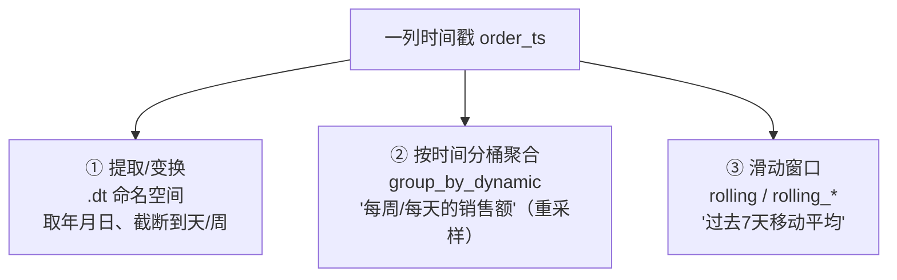
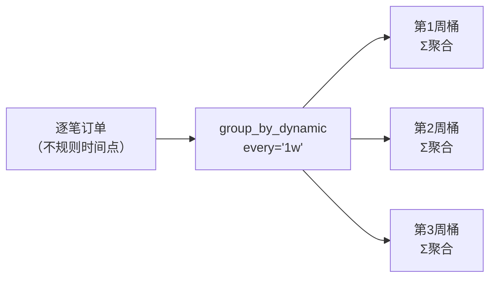
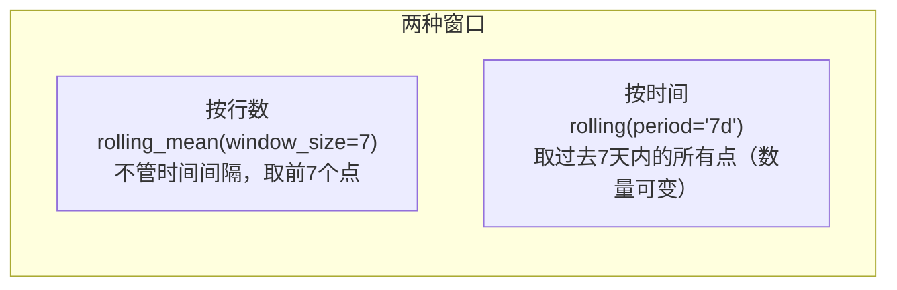

> 时间是最特殊的一类数据：它有序、有粒度（秒/天/月）、有时区、能做"滑动窗口"和"重采样"。Polars 把时间处理做成了一等能力——`.dt` 命名空间 + `group_by_dynamic` + `rolling`，比 pandas 的 `resample`/`rolling` 更统一、更快。我们的 `orders.order_ts`（`Datetime[μs]` 存储、值精确到秒）正好用来实战。

---

## 心智模型：时间处理的三个层次



- **层次一：逐值变换**（`.dt`）——从时间戳里抽取成分（年、月、星期几），或对齐到某粒度（截断到天）。
- **层次二：时间分桶**（`group_by_dynamic`）——把连续时间切成等宽区间再聚合，即"重采样（resample）"。
- **层次三：滑动窗口**（`rolling`）——沿时间轴做移动统计（移动平均、累计和）。

想清楚你要的是"变换/分桶/滑动"哪一层，就知道用哪个 API。

---

## 层次一：`.dt` 命名空间

和第 08 节的 `.str`/`.list` 一样，`.dt` 是时间类型的专属工具箱：

| 操作 | 作用 |
| --- | --- |
| `.dt.year()` / `.month()` / `.day()` | 提取日期成分 |
| `.dt.hour()` / `.minute()` / `.second()` | 提取时间成分 |
| `.dt.weekday()` | 星期几（1=周一） |
| `.dt.truncate("1d")` | **截断**到粒度（"这条记录属于哪一天/哪一周"） |
| `.dt.offset_by("3d")` | 时间平移 |
| `.dt.strftime(fmt)` | 格式化成字符串 |

`.dt.truncate` 特别重要——它是"手动重采样"的基础：把每条记录对齐到它所属的天/周，再普通 `group_by`，就等价于按天/周聚合。

---

## 层次二：`group_by_dynamic` —— 时间重采样

如果你要"每周的订单数""每天的销售额"，`group_by_dynamic` 是专用工具。它按固定时间窗切分（要求数据按时间**有序**）：

```python
df.sort("order_ts").group_by_dynamic(
    "order_ts",       # 时间列
    every="1w",       # 每个窗口的步长（1周）
    period="1w",      # 窗口宽度（默认=every，即不重叠）
).agg(
    pl.len().alias("n_orders"),
    pl.col("revenue").sum().alias("total"),
)
```



- `every` 控制窗口起点间隔，`period` 控制窗口宽度。二者相等 = 不重叠的常规重采样；`period > every` = 重叠的滑动区间。
- 支持日历感知的粒度：`"1mo"`（月）、`"1q"`（季）、`"1y"`（年），能正确处理"月有 28~31 天"这类问题——这是纯 numpy 难做对的。
- 可配合 `group_by=` 参数按类别分别重采样（如"每个城市每周的销售额"）。

> 对照：pandas 的 `df.resample("W").sum()` 是对应物，但 pandas 的 resample 依赖 DatetimeIndex（又是 index！），而 Polars 用普通列，语义更清晰、可组合进 Lazy 管道。SQL 里通常要 `date_trunc('week', ts)` + `GROUP BY`。

---

## 层次三：`rolling` —— 滑动窗口

移动平均、移动求和这类"沿时间轴滑动"的统计，有两种写法：

**A. 固定行数窗口**（`rolling_mean` 等表达式）：按"前 N 行"滑动。

```python
pl.col("revenue").rolling_mean(window_size=7)  # 前7行的移动平均
```

**B. 时间感知窗口**（`rolling` 上下文）：按"前 N 天"滑动，即使数据点间隔不均也正确。

```python
df.sort("ts").rolling(index_column="ts", period="7d").agg(
    pl.col("revenue").sum().alias("rev_7d")
)
```



- **按行数**：简单，适合等间隔数据。
- **按时间**：更严谨，适合不规则时间戳（金融 tick、日志）——"过去7天"里可能有 3 个点也可能有 300 个点，它都对。

---

## 时区与解析（简述）

- **解析字符串成时间**：`pl.col("s").str.to_datetime("%Y-%m-%d %H:%M:%S")`（第 08 节 `.str` 的延伸）。
- **时区**：`Datetime` 可带时区，`.dt.convert_time_zone("Asia/Shanghai")` 转换，`.dt.replace_time_zone(...)` 打标。生产中处理跨时区数据时，**先统一到 UTC 存储、展示时再转本地**是稳妥策略。

---

## 配套代码在演示什么

`code/09_time_series.py`：

1. **`.dt` 提取**：从 order_ts 抽取年/月/星期/小时，并 truncate 到天。
2. **手动重采样**：`truncate("1d")` + `group_by` 按天聚合。
3. **`group_by_dynamic`**：按周、按月重采样销售额，对照 pandas `resample`。
4. **分组重采样**：每个渠道每周的销售额（`group_by=`）。
5. **rolling 按行数**：7 单移动平均。
6. **rolling 按时间**：过去 7 天的销售额（时间感知窗口）。

```bash
uv run code/09_time_series.py
```

---

## 本节要点回收

1. 时间处理三层次：**`.dt` 变换 / `group_by_dynamic` 分桶重采样 / `rolling` 滑动窗口**。
2. `.dt.truncate` 是"对齐到粒度"的基础，手动重采样靠它 + `group_by`。
3. `group_by_dynamic` 支持**日历感知粒度**（月/季/年），`every`/`period` 控制步长与宽度。
4. rolling 有**按行数**与**按时间**两种窗口，不规则时间戳务必用按时间。
5. 对照 pandas：Polars 不依赖 DatetimeIndex，时间列是普通列，可组合进 Lazy 管道。

下一节进入"生产层"：IO 与流式引擎，看如何读写各种格式、处理比内存大的数据。
