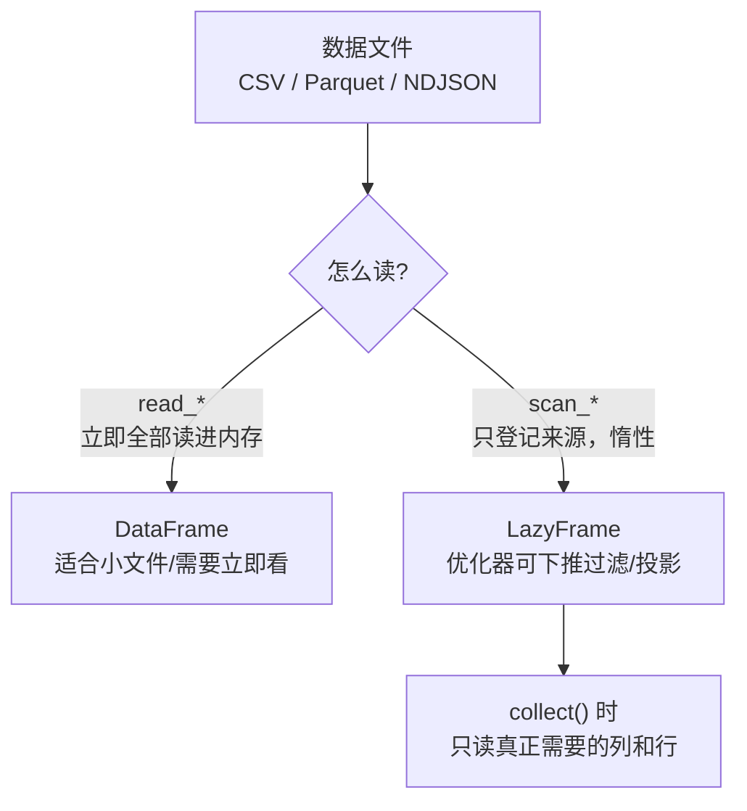
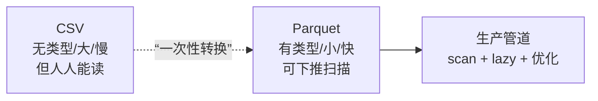
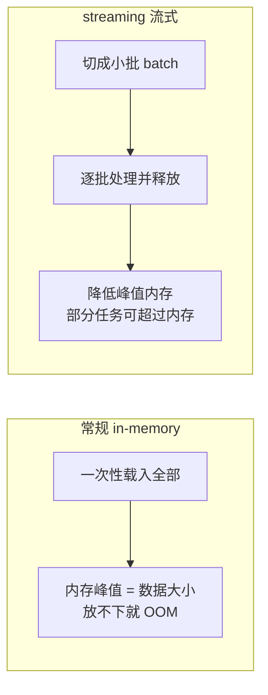

> 进入"生产层"。数据分析的起点和终点都是 IO——把数据读进来、把结果写出去。Polars 的 IO 设计有两个亮点：**`scan_*` 惰性扫描**（配合第 04 节优化器把过滤/投影下推到文件层）和 **streaming 流式引擎**（处理比内存还大的数据）。这两点是它相对 pandas 在"大数据"场景的关键优势。

---

## 心智模型：read vs scan，两条读取路径

回顾第 04 节的"孪生动词"，在 IO 层它是最重要的选择：



- **`read_parquet(...)`**：立即把整个文件加载成 DataFrame。简单直接，适合小数据。
- **`scan_parquet(...)`**：返回 LazyFrame，什么都不读。后续的 `filter`/`select` 会被优化器**下推到文件读取阶段**——只解码用到的列、只读满足条件的行组。**生产读取应默认 scan。**

> 具体收益（第 04 节已用 explain 证明）：`scan_parquet(...).select("a","b").filter(...)` 在读 100 列的大文件时，可能只真正读取 2 列的部分行组，IO 量差几个数量级。

---

## 各格式的取舍

| 格式 | 读 | 写 | 特点与适用 |
| --- | --- | --- | --- |
| **Parquet** | `scan_parquet` / `read_parquet` | `write_parquet` / `sink_parquet` | **首选**。列式、带 schema、压缩、支持下推。生产标准格式 |
| **CSV** | `scan_csv` / `read_csv` | `write_csv` | 人类可读、通用，但无类型、需推断、体积大。仅用于交换 |
| **NDJSON** | `scan_ndjson` / `read_ndjson` | `write_ndjson` | 每行一个 JSON，适合日志、半结构化流数据 |
| **IPC/Arrow** | `scan_ipc` / `read_ipc` | `write_ipc` | Arrow 原生格式，零拷贝、跨语言极快 |

**核心建议**：中间结果和数据湖用 **Parquet**（可 scan、可下推、体积小）；只有对外交换时才用 CSV。我们的数据集同时存了 CSV 和 Parquet，正是为了对比。



---

## streaming：处理比内存大的数据

普通 `collect()` 使用内存引擎执行。流式引擎会把可流式化的部分切成小批（batch）边读边算，通常能显著降低峰值内存，并让部分超内存任务成为可能：

```python
result = (
    pl.scan_parquet("huge.parquet")   # 惰性
    .filter(pl.col("x") > 0)
    .group_by("key").agg(pl.col("v").sum())
    .collect(engine="streaming")       # 流式执行
)
```



- 触发方式：`collect(engine="streaming")`（旧版本是 `collect(streaming=True)`）。
- streaming 不等于恒定内存：高基数 `group_by` 需要保存聚合状态，排序等阻塞算子可能占用较多内存；不支持的查询还会回退到内存引擎。
- `collect()` 最终仍要返回完整 DataFrame，因此结果本身必须放得进内存。若结果也很大，应使用 `sink_*`。
- **`sink_parquet` / `sink_csv`**：边算边写到磁盘，不物化完整结果表。`scan → 变换 → sink` 是大文件转换/ETL 的常用形态。

---

## 与 DuckDB 的对照

DuckDB 也能直接查询 Parquet 且自带流式执行。两者在"大数据 IO"上是最直接的对照组：

| 维度 | Polars scan + streaming | DuckDB |
| --- | --- | --- |
| 接口 | Python 表达式 / Lazy | SQL |
| 下推优化 | 有（投影/谓词/切片） | 有 |
| 超内存处理 | streaming 引擎 | 原生 out-of-core |
| 与对方互通 | `pl.read_database` / Arrow | 可直接查 Polars DataFrame |

实践中二者常**混用**：用 DuckDB 做重型 SQL join/聚合，结果零拷贝转成 Polars 做后续表达式处理（都基于 Arrow）。它们不是竞争，而是互补。

---

## 配套代码在演示什么

`code/10_io_streaming.py`：

1. **read vs scan**：对比返回类型，用 explain 看 scan 的下推。
2. **格式往返**：Parquet / CSV / NDJSON 的写与读，对比文件体积。
3. **CSV 类型推断的坑**：CSV 无类型，展示读回来可能与原类型不同，Parquet 则无损。
4. **streaming collect**：用流式引擎跑一个聚合。
5. **sink_parquet**：流式写出，全程不物化整表。
6. **DuckDB 直读 Parquet**：对照 Polars scan。

```bash
uv run code/10_io_streaming.py
```

---

## 本节要点回收

1. **scan_* 优于 read_***：惰性扫描让优化器把过滤/投影下推到文件层，大文件收益巨大。
2. 格式选择：**Parquet 首选**（列式/有类型/可下推），CSV 仅用于交换。
3. **streaming 引擎**（`collect(engine="streaming")`）分批执行以降低内存压力，但不保证恒定内存或所有查询都能超内存运行。
4. **sink_*** 是流式写出，`scan → 变换 → sink` 可避免物化完整结果表。
5. Polars 与 DuckDB 基于同一套 Arrow，**混用互补**而非竞争。

下一节：性能剖析与最佳实践——用真实 benchmark 量化前面所有"更快"的论断。
