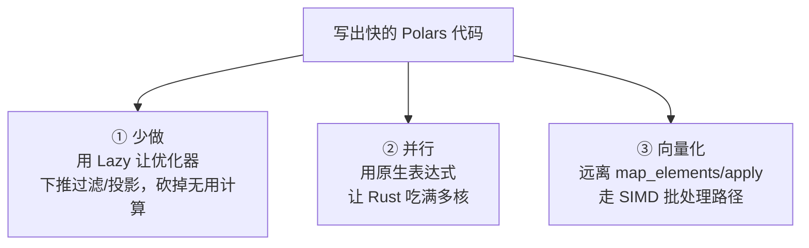
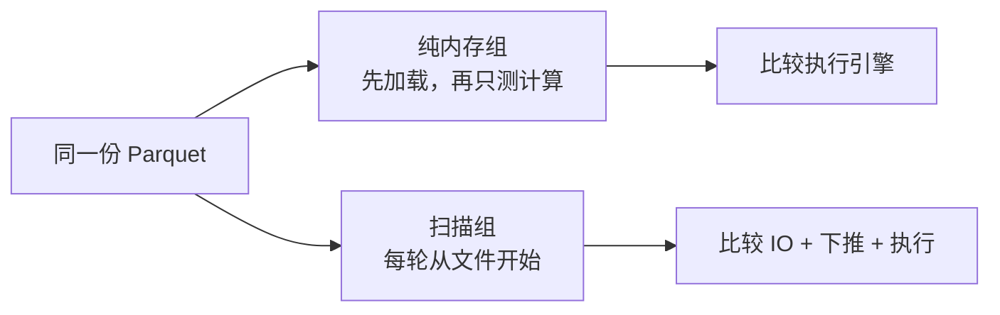
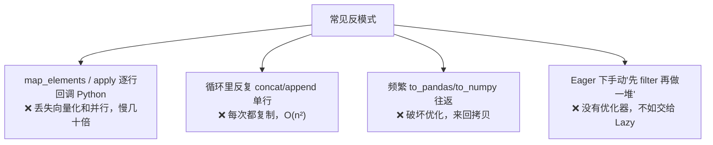

> 前面十节反复说 Polars"更快"。这一节**用真实 benchmark 兑现这些论断**——不玄学、不拍脑袋，跑数字给你看。同时把散落各节的性能建议收敛成一份"最佳实践 + 反模式"清单。这符合"确定性信号优先"：能测量的就测量，不靠感觉。

---

## 心智模型：性能来自"少做 + 并行 + 向量化"

回顾第 00 节的四个"快"的原因，落到实践就是三条可操作的原则：



几乎所有 Polars 性能问题，根因都能归到"违反了这三条中的某一条"。

---

## Benchmark：先把比较条件对齐

配套代码 `code/11_performance.py` 会现场生成一个**300 万行**的数据集，对同一任务（过滤 + 分组聚合）分两组测量：

1. **纯内存计算**：pandas 与 Polars Eager 都复用已经加载的数据。
2. **文件扫描 + 计算**：pandas、Polars Eager、Polars Lazy 和 DuckDB 都从同一个 Parquet 文件开始，并把 IO 计入耗时。



绝对时间与倍率会随 CPU、线程数、文件缓存、数据分布和依赖版本变化。这个 benchmark 用于展示测量方法和当前机器上的结果，不把一次运行外推成稳定的“固定倍数”。

> **误解澄清**：Lazy 不是"永远比 Eager 快"。Lazy 的优势在**多步管道**（优化器能砍掉无用步骤）和**大于内存数据**（streaming）。如果只是内存里的单步操作，Eager 可能更直接。选 Lazy 是为了"优化器介入"和"省内存"，不是无脑求快。

---

## 最佳实践清单

### ✅ 该做的

1. **多步管道 + 从文件读 → 用 Lazy**：`scan_* → 变换 → collect`，让优化器下推。
2. **优先内置表达式**：数学、字符串、时间、条件逻辑几乎都有原生表达式，全部向量化 + 并行。
3. **一次 `with_columns` 塞多个表达式**：Polars 会并行计算它们，比链式多次 `with_columns` 更好。
4. **用 `over` 代替"group_by + join 回原表"**（第 05 节）。
5. **选对 dtype**：低基数字符串用 `Categorical`/`Enum`；能用 `Int32` 不用 `Int64`（省内存 = 更快）。
6. **大数据用 streaming**（第 10 节）：`collect(engine="streaming")` / `sink_*`。

### ❌ 反模式（性能杀手）



1. **`map_elements` / `apply`**：最大的性能杀手。第 02 节已警告，本节用 benchmark 量化——同一计算，原生表达式 vs `map_elements` 可能差几十倍。
2. **循环累积**：在 Python 循环里逐行 `concat`/构造 DataFrame。应该一次性构造或用表达式。
3. **无谓的 pandas/numpy 往返**：每次 `to_pandas()` 都是拷贝 + 脱离优化器。
4. **在 Eager 下手工"优化"**：与其自己纠结操作顺序，不如切 Lazy 让优化器做。

---

## 如何剖析：找到瓶颈再优化

不要凭猜测优化。用工具定位：

- **`.explain()`**（第 04 节）：看 Lazy 计划，确认下推是否生效、是否有意外的全表扫描、哪些节点走了流式（`streaming_*`）。这是最可靠的静态剖析手段。
- **A/B 计时对照**：像本节 benchmark 那样，对可疑写法做多轮取最优的计时对比。
- **`.profile()`（注意）**：它能拿到每个算子的耗时，但在流式/多线程并发执行下，单算子的墙钟耗时可能相互重叠而**具有误导性**。定位瓶颈优先用 `explain` 看计划、再用 A/B 计时验证，把 `.profile()` 当作辅助参考。

```python
print(lf.explain())              # 确认下推/流式是否如预期
timeit(lambda: lf.collect())     # 对整条管道计时作为基线
```

> 工程哲学（呼应"真实执行剖析优先"）：**先测量，再优化**。`explain` 给你计划层的确定性信息，A/B 计时给你墙钟时间的确定性信息，二者结合远胜于盲猜。

---

## 配套代码在演示什么

`code/11_performance.py`：

1. **两组 benchmark**：分别测纯内存计算和“Parquet 扫描 + 计算”，避免把内存数据与磁盘 IO 直接比较。
2. **map_elements vs 原生表达式**：量化"翻译腔"的代价（预计差一个数量级以上）。
3. **一次性 vs 多次 with_columns**：展示并行计算多表达式的收益。
4. **`.explain()` + 计时**：打印优化计划并对整条管道计时，演示如何定位瓶颈。
5. **dtype 对内存的影响**：Int64 vs Int32 vs Categorical 的体积对比。

> 注意：benchmark 会生成临时大文件并跑若干轮，本脚本运行需要几秒到十几秒，属正常。

```bash
uv run code/11_performance.py
```

---

## 本节要点回收

1. 性能三原则：**少做（Lazy 下推）、并行（原生表达式）、向量化（远离 apply）**。
2. Benchmark 必须先对齐数据入口、计时边界和输出语义；倍率是当前环境的测量结果，不是跨机器保证。
3. **Lazy 不总比 Eager 快**——它的价值在多步优化和超内存 streaming，别无脑求快。
4. 头号反模式是 **`map_elements`/`apply`**；其次是循环累积、无谓 pandas 往返。
5. **先剖析（`.explain()` + A/B 计时）再优化**，用确定性信号取代猜测。

生产层的最后一节：从 pandas 迁移的语义差异对照与 SQL 接口——帮你把旧经验平滑搬过来。
