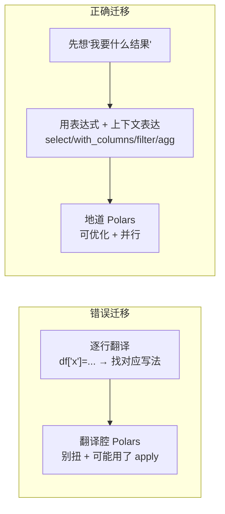
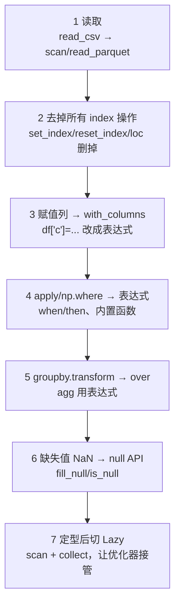

> 生产层的最后一节，帮你把旧经验平滑搬过来。如果你有 pandas 背景，这一节是**语义差异对照表 + 迁移清单**；如果你更习惯 SQL，Polars 内置的 SQL 接口让你几乎零成本上手。把这一节当作"翻译词典"，遇到卡壳时回来查。

---

## 心智模型：迁移不是"改语法"，而是"换思维"

最大的陷阱是把 pandas 代码逐行"翻译"成 Polars。那样你会写出别扭、低效、还容易踩坑的代码。正确的迁移是**换用第 02 节的表达式思维**：



带着这个心态，再看下面的对照表。

---

## 语义差异对照表（高频坑）

| 主题 | pandas | Polars | 迁移要点 |
| --- | --- | --- | --- |
| **索引 index** | 有 index，自动对齐 | **无 index**，位置即身份 | 忘掉 `set_index`/`reset_index`/`loc`，用 `filter`/列选择 |
| **就地修改** | `inplace=True` | **一切返回新对象** | 没有 inplace，用赋值 `df = df.with_columns(...)` |
| **缺失值** | `NaN` 混用表示缺失 | **null 与 NaN 分离** | 用 `fill_null`/`is_null`，别再用 NaN 表缺失（第 01 节） |
| **新增列** | `df['c'] = ...` | `df.with_columns(...)` | 表达式而非赋值 |
| **条件列** | `np.where` / `apply` | `when/then/otherwise` | 向量化条件（第 02 节） |
| **自定义函数** | `.apply(lambda)` | 优先内置表达式，避免 `map_elements` | 头号性能坑（第 11 节） |
| **分组转换** | `groupby.transform('sum')` | `expr.sum().over(...)` | 窗口函数（第 05 节） |
| **重命名** | `df.rename(columns=...)` | `df.rename({...})` | 类似 |
| **行过滤** | `df[df.a>1]`（布尔索引） | `df.filter(pl.col('a')>1)` | 无 `SettingWithCopyWarning` |
| **链式** | 需 `.pipe()` 或中间变量 | 天然方法链 | Polars 为链式而生 |
| **类型** | 常隐式转换（int→float） | 显式、稳定 | int 带 null 不退化（第 01 节） |

---

## 迁移清单（Checklist）

按这个顺序改写一段 pandas 代码，基本不会出错：



1. **入口**：`pd.read_csv` → `pl.scan_parquet`（顺便把数据转成 Parquet）。
2. **删 index**：所有 `set_index`/`reset_index`/`loc[label]` 都不需要。
3. **列赋值 → `with_columns`**：`df['c'] = df['a']+1` → `df.with_columns((pl.col('a')+1).alias('c'))`。
4. **`apply`/`np.where` → 表达式**：能用内置表达式就别回调 Python。
5. **`transform` → `over`**：分组广播用窗口函数。
6. **缺失值**：`fillna` → `fill_null`，注意 null≠NaN。
7. **定型后切 Lazy**：探索用 Eager，稳定后改 `scan_*...collect()`。

---

## 互操作：pandas ↔ Polars 的成本与类型语义

迁移不必"一步到位"。Polars 与 pandas 可以方便互转，允许你**渐进式迁移**，但互转并非默认零成本或对所有 dtype 都无损：

```python
pl.from_pandas(pdf)   # pandas → Polars
df.to_pandas()        # 默认转换为 NumPy-backed pandas，通常会复制
df.to_pandas(use_pyarrow_extension_array=True)  # 部分类型可零拷贝并保留 null
```

默认 `to_pandas()` 会复制数据，整数 null 也可能转成浮点 `NaN`。启用 Arrow 扩展数组可减少复制并保留 null，但下游 pandas 操作仍可能触发 NumPy 转换。迁移测试应同时检查值、dtype、null 和时区语义，不能只看简单表的 `equals()`。

策略建议：**新代码直接写 Polars，旧 pandas 代码在边界处用 `from_pandas`/`to_pandas` 衔接**，逐步把热点路径换成 Polars，而不是推倒重来。

---

## SQL 接口：用 SQL 直接查 Polars

如果你更习惯 SQL，Polars 内置 SQL 引擎，可直接对 DataFrame/LazyFrame 跑 SQL——**不需要 DuckDB**（当然也能用 DuckDB，见前面各节对照）：

**方式一：`pl.sql()`**（快速查询，表名自动绑定同名变量）

```python
orders = pl.read_parquet("orders.parquet")
pl.sql("SELECT channel, count(*) AS n FROM orders GROUP BY channel", eager=True)
```

**方式二：`pl.SQLContext`**（显式注册表，适合多表/复杂场景）

```python
ctx = pl.SQLContext(o=orders.lazy(), c=customers.lazy())
ctx.execute("SELECT * FROM o JOIN c USING(customer_id)", eager=True)
```

```mermaid
flowchart LR
    subgraph 三种"用 SQL"的方式
        A["pl.sql()<br/>Polars 原生 SQL<br/>结果是 Polars, 走 Polars 优化器"]
        B["pl.SQLContext<br/>多表注册, 更可控"]
        C["duckdb.sql()<br/>DuckDB 引擎<br/>Arrow 零拷贝互通"]
    end
```

> 何时用哪个？**表达式能写清楚的，就用表达式**（可断点、可组合、类型安全）。SQL 接口适合：从 SQL 背景过渡、粘贴现成 SQL、或某些 SQL 表达更自然的复杂查询。Polars 原生 SQL 和表达式 API 底层是同一个优化器，性能一致。

---

## 配套代码在演示什么

`code/12_migration_sql.py`：

1. **对照改写**：一段典型 pandas 代码 → 地道 Polars，逐点对应清单。
2. **index 的消失**：pandas `set_index`/`loc` 的等价 Polars 写法。
3. **NaN vs null 迁移坑**：`fillna` 的行为差异。
4. **pandas ↔ Polars 互转**：对比默认复制与 Arrow-backed pandas 的 dtype/null 语义。
5. **`pl.sql()`**：原生 SQL 查询。
6. **`pl.SQLContext`**：多表 SQL join，与表达式写法结果对照。

```bash
uv run code/12_migration_sql.py
```

---

## 本节要点回收

1. 迁移是**换思维（表达式）**，不是逐行翻译语法。
2. 记牢高频差异：**无 index、无 inplace、null≠NaN、apply→表达式、transform→over**。
3. 按 7 步清单改写 pandas 代码，最后**切 Lazy** 让优化器接管。
4. 用 `from_pandas`/`to_pandas` 做**渐进式迁移**，不必推倒重来。
5. Polars 内置 **`pl.sql` / `pl.SQLContext`**，SQL 背景可零成本上手，与表达式共享同一优化器。

---

## 阶段小结与后续

至此你已完成 Polars 的**核心心智模型与主干能力**：

- **地基层（01–03）**：DataFrame 是列的集合、表达式是配方、上下文是求值环境。
- **引擎层（04）**：Lazy + 查询优化器是"大脑"。
- **操作层（05–09）**：聚合/连接/重塑/复杂类型/时间，覆盖日常。
- **生产层（10–12）**：IO/流式、性能剖析、迁移落地。

但"会用每个能力"和"能独立交付一个数据项目"之间还有一段路。接下来的**实战层（13–15）**填补它：**13 数据清洗**（真实数据的第一道工序）、**14 端到端实战**（把所有能力串成一条 ETL）、**15 UDF 逃生舱**（内置能力不够时的正确做法）。读完它们，你才真正具备用 Polars 独立作战的能力。
