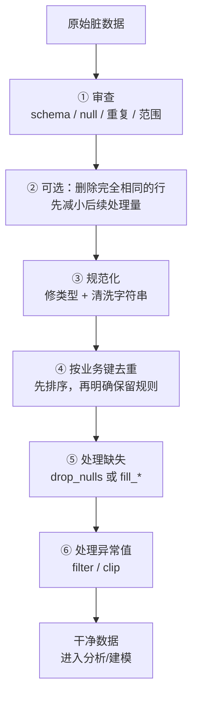
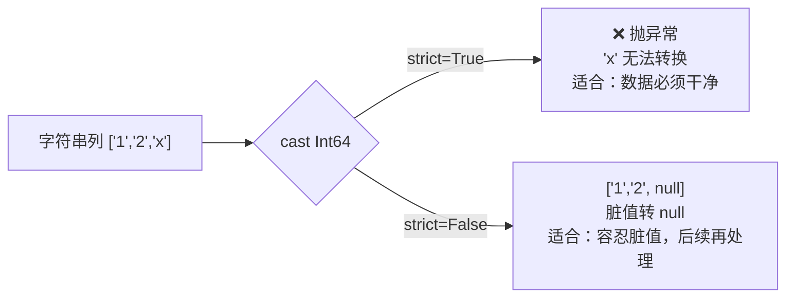
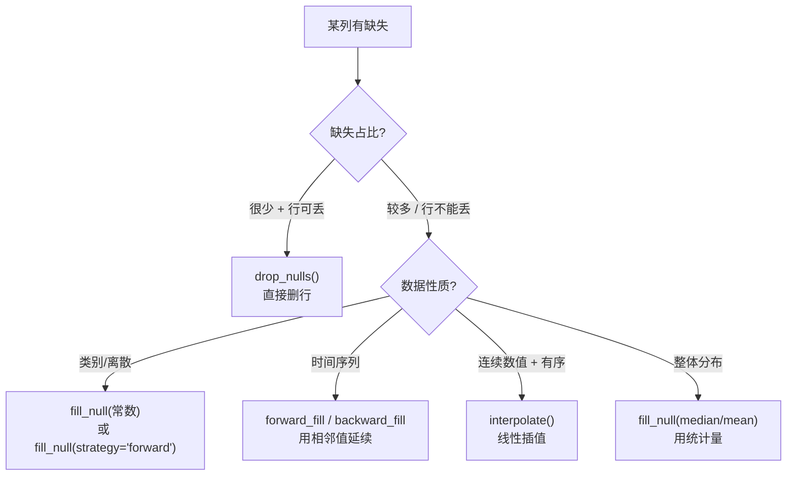

> 前面的操作层默认数据是"干净"的，但真实世界从不如此——缺失、重复、类型错乱、脏字符串、异常值。这一节把散落在各处的清洗手段收敛成一套**系统化工作流**。我们刻意在第 00 节的数据集里埋了脏料（`city`/`discount` 含 null、`note` 脏字符串、20 条重复行），现在正好拿它开刀。

---

## 心智模型：清洗是一条有依赖关系的流水线

清洗不是随手补丁，但也不存在适用于所有数据的唯一固定顺序。关键是先区分**字节完全相同的物理重复**和**规范化后才相同的业务重复**，再按数据依赖安排步骤：



**为什么要分两次看去重**：本教程注入的 20 行是完全相同的副本，可以在最前面安全删除；但 `"A"` 与 `" a "`、`"01"` 与 `"1"` 只有经过字符串和类型规范化后才可能被判定为同一个业务值。业务键重复还应先按更新时间、版本号或质量规则排序，再确定保留哪一行，避免 `keep="any"` 带来不确定结果。

---

## ① 去重：unique 与重复检测

```python
df.unique()                              # 全列去重（整行完全相同才算重复）
df.unique(subset=["order_id"])           # 按指定列去重（业务主键）
df.unique(subset=["order_id"], keep="first")  # 保留首次出现
```

- `keep`：`"first"` / `"last"` / `"any"`（默认，最快）/ `"none"`（重复的全删）。
- **检测而不删除**：`is_duplicated()` 返回布尔列标记哪些行重复，`is_unique()` 反之。用它们可以先审查再决定。
- **先定义重复的含义**：完全相同的行可直接 `df.unique()`；按业务键去重前，先完成相关列的类型/字符串规范化，并通过排序明确 `first` / `last` 代表什么。

> 对照：pandas 的 `drop_duplicates()` / `duplicated()`；SQL 的 `SELECT DISTINCT` / `ROW_NUMBER() OVER(...)`。Polars 的 `keep="any"` 默认最快，因为不保证顺序、可并行。

---

## ② 类型修复：cast 与 strict 模式

外部数据（尤其 CSV，见第 10 节）常把数字/日期读成字符串。`cast` 负责转换，`strict` 参数决定"转不动时怎么办"：

```python
pl.col("x").cast(pl.Int64)                 # strict=True（默认）：转不动就报错
pl.col("x").cast(pl.Int64, strict=False)   # strict=False：转不动的变 null
```



**选择依据**：数据管道的"契约边界"用 `strict=True`（让脏数据尽早暴露、fail fast）；探索或已知有噪声时用 `strict=False`（先转、脏值降级为 null 再统一处理）。这呼应第 06 节 `validate` 的"及早暴露"哲学。

---

## ③ 缺失值处理：drop 还是 fill，以及 5 种填充策略

**决策树**：缺失该删还是该填？



Polars 的填充工具箱：

| 方法 | 语义 | 适用 |
| --- | --- | --- |
| `drop_nulls()` | 删除含 null 的行 | 缺失少、行可丢弃 |
| `fill_null(value)` | 用常数填充 | 类别列、有明确默认值 |
| `fill_null(strategy="forward")` | 用前一个非空值 | 时间序列、状态延续 |
| `fill_null(strategy="backward")` | 用后一个非空值 | 反向延续 |
| `interpolate()` | 线性插值 | 有序连续数值 |
| `fill_null(pl.col("x").median())` | 用统计量 | 数值列、保持分布 |

> **关键提醒（呼应第 01 节）**：这些都是处理 **null**（缺失）。若列里还有 **NaN**（浮点非数），要单独用 `fill_nan()`。两套 API 不要混。

---

## ④ 异常值处理：过滤与裁剪

异常值有两种处理哲学：

```python
# 哲学 A：删除（filter 掉超出合理范围的行）
df.filter(pl.col("discount").is_between(0, 1))

# 哲学 B：裁剪（clip，把超界值拉回边界，保留行）
df.with_columns(pl.col("discount").clip(0, 1))
```

- **删除**：异常值是错误数据，不该参与分析 → `filter`。
- **裁剪**：异常值是极端但真实的，只想限制其影响 → `clip`（也叫 winsorize 的简化版）。
- 统计式检测：用分位数定义边界，如 `q1 - 1.5*iqr` ~ `q3 + 1.5*iqr`（IQR 法），再 filter/clip。

---

## 配套代码在演示什么

`code/13_cleaning.py` 用真实脏数据集，按流水线顺序演示：

1. **审查脏数据**：统计各列 null 数、重复行数——清洗前先"体检"。
2. **去重**：`unique` 删除那 20 条注入的重复行，`is_duplicated` 检测。
3. **类型修复**：把字符串 cast 成数值，对比 strict=True/False。
4. **字符串归一化**：清洗 `note` 脏值（衔接第 08 节）。
5. **缺失值策略**：对一个含 null 的有序序列演示 drop 与常数 / forward / backward / interpolate / 中位数 5 种填充，对照效果。
6. **异常值**：用 filter 和 clip 两种哲学处理越界折扣。
7. **完整清洗管道**：把上述步骤串成一个 Lazy 管道，输出干净数据（为第 14 节铺垫）。

```bash
uv run code/13_cleaning.py
```

---

## 本节要点回收

1. 清洗步骤存在**数据依赖**而非唯一固定顺序：可先删完全相同的物理副本，但业务键去重要放在类型和字符串规范化之后。
2. `unique` 去重（`keep` 控制保留策略），`is_duplicated`/`is_unique` 只检测不删。
3. `cast` 的 **strict 模式**是"契约边界 fail fast vs 容忍降级"的选择。
4. 缺失值有 **drop + 5 种 fill 策略**，按数据性质选（时间序列用 forward，连续数值用 interpolate）。别把 null 和 NaN 混。
5. 异常值两种哲学：**filter 删除**（错误数据）vs **clip 裁剪**（极端但真实）。

下一节把前面所有能力串起来——一个完整的端到端实战。
