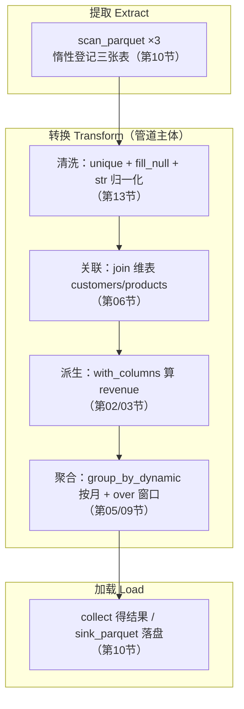
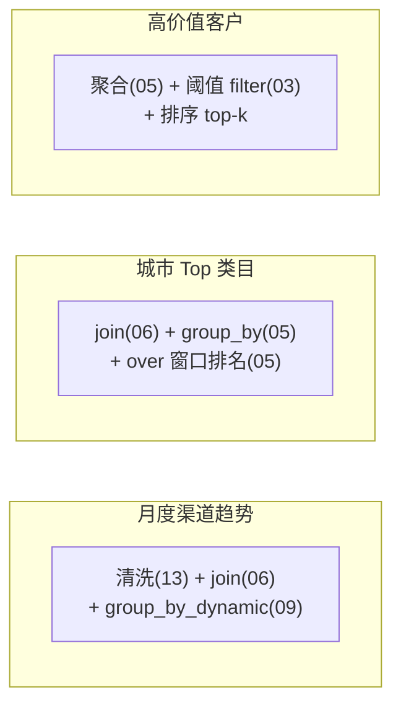

> 前面 13 节是一件件"能力切片"。这一节把它们**串成一条真实的数据管道**——从原始脏数据到业务结论，一气呵成。这不仅是复习，更是回答那个终极问题：**"学了这么多，真拿到一份数据该怎么下手？"** 我们会用一条纯 Lazy 管道，让第 04 节的优化器全程接管。

---

## 业务场景

假设你是电商团队的数据分析师，拿到 `orders` / `customers` / `products` 三张原始表，老板要三个结论：

1. **每月各渠道的销售额趋势**（时间序列 + 分组）。
2. **每个城市的 Top 商品类目**（分组 + 窗口排名，并列第一全部保留）。
3. **高价值客户识别**（聚合 + 阈值）。

数据是脏的（重复、null、脏字符串）。你需要一条**可复现、可优化、可落盘**的管道。

---

## 心智模型：一条管道的解剖

真实管道都遵循同一个骨架。把它记成一句话：**"扫描 → 清洗 → 关联 → 派生 → 聚合 → 落盘"**。



关键理念：**整条链在 `collect()` 之前都是"计划"**。你可以先 `explain()` 检查优化器怎么安排，再执行。这就是"pandas 的手感 + DuckDB 的大脑"在真实项目里的样子。

---

## 为什么全程用 Lazy

对照两种写法的差异：

| 维度 | Eager 逐步写 | 一条 Lazy 管道 |
| --- | --- | --- |
| 中间结果 | 每步都物化进内存 | 不物化，只搭计划 |
| 优化 | 无（各步独立） | 全局优化：投影/谓词下推、join 重排 |
| 内存 | 峰值 = 最大中间表 | 可流式，峰值可控 |
| 可读性 | 一堆中间变量 | 一条声明式链 |
| 调试 | 随时 print | `explain()` 看计划 + 拆段 collect |

**结论**：生产管道默认 Lazy。Eager 只在你需要"盯着某一步的中间结果"调试时临时用。

---

## 三个分析各用了哪些前置知识

这一节的价值在于**看见能力如何组合**。三个分析分别是不同能力的"和弦"：



没有哪个分析用到"新" API——全是前面学过的，只是**组合**起来。这正是掌握一个工具的标志：不再问"用什么函数"，而是问"这个结果需要哪几种能力的组合"。

---

## 工程实践要点

1. **管道函数化**：把每段逻辑封装成返回 `LazyFrame` 的函数，可单独测试、可复用（配套代码就这么做）。
2. **清洗与分析分离**：先产出一个"干净的宽表"LazyFrame，各分析基于它分叉。
3. **分叉查询联合收集**：复用同一个 LazyFrame 不等于缓存；分别 `collect()` 会重复执行上游。用 `pl.collect_all([...])` 一次提交，公共子计划消除会让共同的扫描、清洗与 join 只执行一次。
4. **先 explain 再 collect**：大数据上线前，用 `explain()` 确认下推生效、没有意外的全表物化。
5. **落盘用 sink**：最终结果如果大，用 `sink_parquet` 流式写出（第 10 节），而非 collect 到内存再写。
6. **可复现**：固定的数据源 + 无随机的转换让结果可重复验证；对并列结果还要显式定义业务语义和稳定排序。

---

## 配套代码在演示什么

`code/14_end_to_end.py` 是一个**完整、可运行、函数化**的 ETL：

1. `build_clean_orders()`：扫描 + 清洗 + join，产出干净宽表（LazyFrame）。
2. 三个 `analysis_*()`：分别返回月度趋势、城市 Top 类目和高价值客户的 LazyFrame。
3. **`pl.collect_all()`**：联合提交三个分析，复用公共上游计划。
4. **explain 展示**：打印主管道的优化计划，看能力组合后优化器怎么安排。
5. **sink 落盘**：把清洗后的宽表流式写出，演示完整 Load 阶段。

```bash
uv run code/14_end_to_end.py
```

---

## 本节要点回收

1. 真实管道的骨架：**扫描 → 清洗 → 关联 → 派生 → 聚合 → 落盘**。
2. **生产默认 Lazy**：全程不物化中间结果，让优化器全局接管，Eager 仅用于临时调试。
3. 复杂分析 = **已学能力的组合**，掌握的标志是从"用什么函数"转向"需要哪些能力的和弦"。
4. 工程实践：管道函数化、分叉查询用 `collect_all`、先 explain 再 collect、大结果用 sink、保证可复现。

下一节是最后的"逃生舱"——当内置表达式真的不够用时，如何正确写自定义函数并与生态互通。
