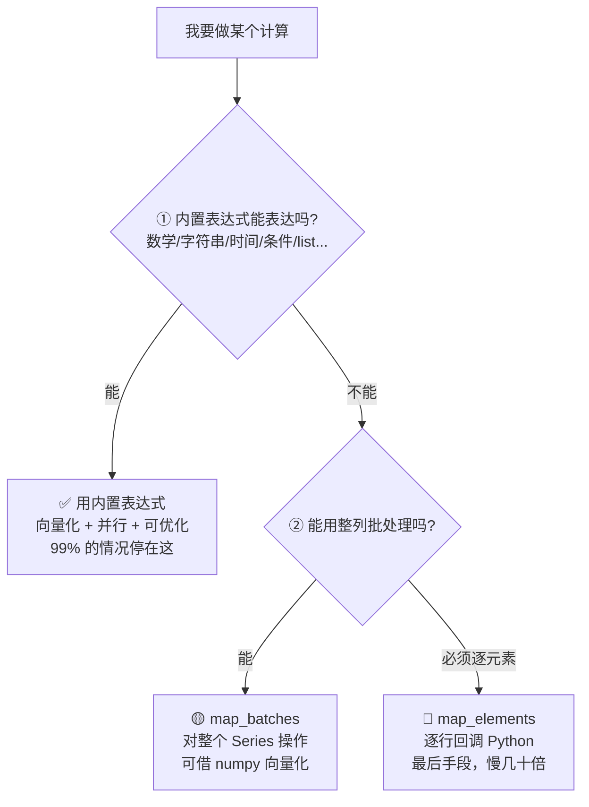
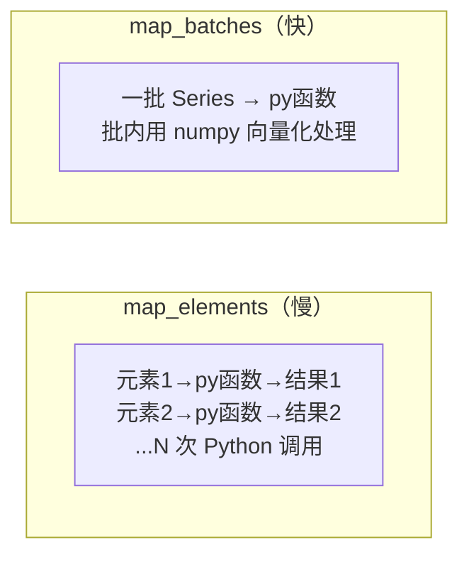
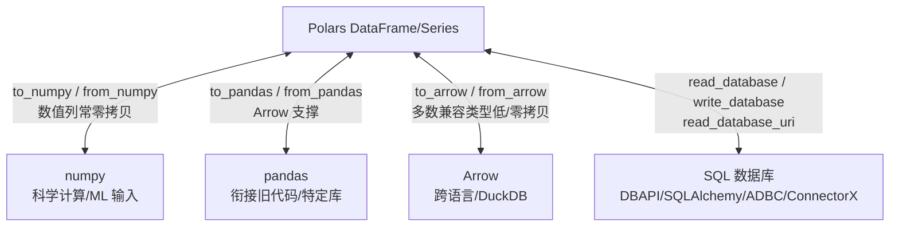
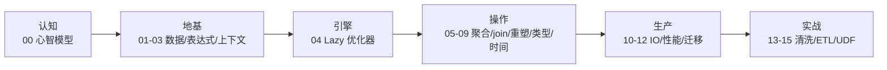

> 第 02 节和第 11 节反复强调"远离 `map_elements`"。但总有内置表达式覆盖不到的场景——这时你需要**逃生舱**：正确地写自定义函数（UDF），以及与 numpy/pandas 生态互通。这一节讲"当规则用尽时，如何优雅地打破规则"，并守住性能底线。

---

## 心智模型：一个"降级阶梯"

面对一个计算需求，按这个阶梯从上往下找，**能停在越靠上越好**：



**核心原则**：`map_elements` 是阶梯最底层的"核按钮"，第 11 节实测它比原生表达式慢一个数量级以上（视机器和数据量，常见几十倍）。绝大多数"我以为需要 UDF"的场景，其实内置表达式或 `map_batches` 就能解决。

---

## map_batches：批量处理（首选的 UDF）

`map_batches` 把一批 Series 交给函数，而不是逐个标量回调。这意味着函数内部可以用 numpy 等库向量化处理一个批次：

```python
# np.sinc 在当前 Polars 中没有直接对应的表达式
pl.col("x").map_batches(
    lambda s: pl.Series(np.sinc(s.to_numpy())),
    return_dtype=pl.Float64,
    is_elementwise=True,
)
```



- 函数签名通常是 `Series -> Series`，输入可能是整列，也可能是执行器切出的批次。
- Python 调用次数远少于逐元素的 N 次，但不保证全程只调用一次；Polars 还可能用样例数据推断类型。
- UDF 必须是**纯函数**，不能依赖调用次数、修改输入或读写可变外部状态。
- 尽量声明 `return_dtype`；若变换逐元素且输出等长，可声明 `is_elementwise=True` 以允许更多优化。

**传多列给 UDF**：用 `pl.struct` 把多列打包成一个 struct Series 传进去，函数内用 `.struct.field()` 取各列：

```python
pl.struct(["a", "b"]).map_batches(
    lambda s: s.struct.field("a") + s.struct.field("b")
)
```

这是"UDF 需要多个输入列"时的标准姿势（回顾第 08 节 Struct 作为"多值容器"的作用）。

---

## 什么时候 map_elements 真的无可避免

极少数场景确实需要逐元素：
- 调用一个只接受标量的第三方库（如某些不支持向量化的解析器）。
- 每行要做复杂的、依赖 Python 对象的逻辑（如解析不规则嵌套 JSON 的边角情况）。

此时的止损措施：
1. **务必传 `return_dtype`**，省去 Polars 推断开销。
2. **先过滤再 map**：只对真正需要的子集调用，别全表跑。
3. **考虑缓存**：如果输入有大量重复值，先 `unique` 算好映射再 join 回去。

---

## 生态互操作：Polars 不是孤岛

Polars 基于 Arrow，与生态零/低成本互通。这让你能"用 Polars 做主力，需要时借力其他工具"：



| 方向 | 方法 | 说明 |
| --- | --- | --- |
| → numpy | `df["x"].to_numpy()` | 喂给 sklearn/scipy；数值无缺失时常零拷贝 |
| ← numpy | `pl.Series(np_array)` | numpy 结果转回 Polars |
| → pandas | `df.to_pandas()` | 衔接只吃 pandas 的库（如某些绘图） |
| ← pandas | `pl.from_pandas(pdf)` | 渐进式迁移（第 12 节） |
| ← 已有数据库连接 | `pl.read_database(query, connection)` | 接受兼容的 DBAPI、SQLAlchemy、ADBC 等连接或游标 |
| ← 数据库 URI | `pl.read_database_uri(query, uri, engine=...)` | 由 ConnectorX 或 ADBC 等引擎建立连接，适合直接传 URI |
| → 数据库 | `df.write_database(table, connection)` | 使用 SQLAlchemy 或 ADBC 等写入引擎；具体能力取决于驱动 |

> **性能提示**：`to_numpy()` 对无缺失的数值列通常零拷贝（直接共享内存）；含 null 或字符串列则需复制。互操作虽方便，但每次跨界都可能脱离 Polars 优化器，热路径上别频繁往返（第 11 节反模式）。

---

## 可视化：保持轻量

Polars 本身不是绘图库。可视化的务实选择：

- **`df.plot.*`**：Polars 内置的绘图接口（基于 Altair），语法便捷，但**需要额外安装 altair**。
- **交给专业库**：`df.to_pandas()` 后用 matplotlib/seaborn，或把聚合结果喂给任何绘图工具。
- **本教程的选择**：为保持"零额外依赖"，配套代码用**文本化的方式**（如把分布打印成 ASCII 条形）演示"如何把 Polars 聚合结果导向可视化"，真实项目里替换成你惯用的绘图库即可。

> 心智模型：**Polars 负责把数据算成"绘图就绪"的小表，绘图交给专业库。** 别期待在 Polars 里做复杂图表。

---

## 延伸阅读（一句话带过）

这些是更进阶/特定场景的能力，用到时再查官方文档即可，不展开：
- **GPU 引擎**（`collect(engine="gpu")`）：基于 cuDF，需 NVIDIA GPU + CUDA（Mac 无法使用）。
- **Rust plugins**：用 Rust 写高性能自定义表达式并注册进 Polars，面向库作者。
- **`pl.Config`**：调整显示行列数、字符串长度等输出行为。
- **`polars.testing`**：`assert_frame_equal` 等，写单元测试时用。

---

## 配套代码在演示什么

`code/15_udf_interop.py`（保持零额外依赖）：

1. **降级阶梯对照**：同一变换用内置表达式 / map_batches / map_elements 三种写法，验证结果一致。
2. **map_batches + numpy**：函数内用 numpy 向量化处理批次，并声明输出类型与逐元素语义。
3. **struct 传多列 UDF**：把两列打包传给自定义函数。
4. **map_elements 止损**：演示 return_dtype + 先过滤再 map。
5. **numpy 互转**：to_numpy / from_numpy 往返。
6. **文本可视化**：把渠道销售额分布打印成 ASCII 条形图（示意"聚合→可视化"的衔接）。

```bash
uv run code/15_udf_interop.py
```

---

## 本节要点回收

1. UDF 是**降级阶梯**：内置表达式 → `map_batches`（整列，首选 UDF）→ `map_elements`（逐元素，核按钮）。
2. `map_batches` 显著减少 Python 调用，但不保证只调用一次；UDF 要纯净并声明 `return_dtype`，**多列输入用 `pl.struct` 打包**。
3. `map_elements` 无可避免时的止损：传 `return_dtype`、先过滤、缓存重复值。
4. 生态互通基于 Arrow：`to_numpy`/`to_pandas`/`to_arrow`，但**热路径别频繁跨界**。
5. 可视化交给专业库，**Polars 只负责算出绘图就绪的小表**。

至此，从心智模型到逃生舱，你已经拥有了驾驭 Polars 的完整地图。

---

## 全书收束

你已经走完从"完全不懂 Polars"到"能独立用它作战"的完整路径：



- **认知层（00）**：Polars = pandas 的手感 + DuckDB 的大脑。
- **地基层（01–03）**：DataFrame 是列的集合、表达式是配方、上下文是求值环境。
- **引擎层（04）**：Lazy + 查询优化器是"大脑"。
- **操作层（05–09）**：聚合/连接/重塑/复杂类型/时间，覆盖日常。
- **生产层（10–12）**：IO/流式、性能剖析、pandas 迁移。
- **实战层（13–15）**：清洗流水线、端到端 ETL、UDF 逃生舱。

回到第 00 节那句话——**Polars = pandas 的手感 + DuckDB 的大脑**。现在你不仅理解了它，还能用代码把它跑出来。接下来最好的学习，就是拿你自己的真实数据，用 `scan_parquet` 起手，把第 14 节的管道骨架套上去，写下你的第一条生产级 Lazy 管道。
