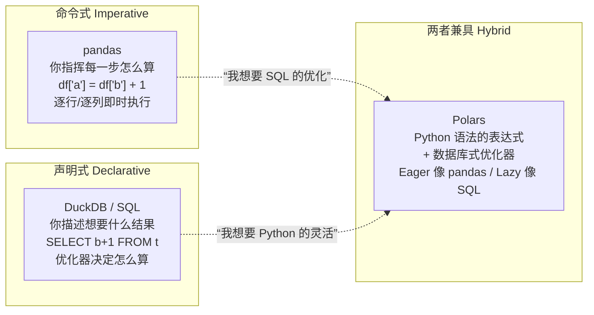
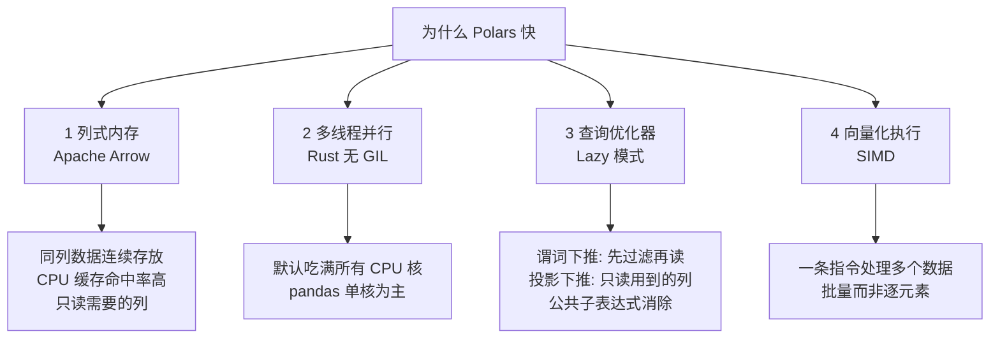
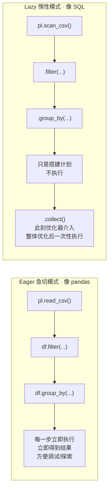
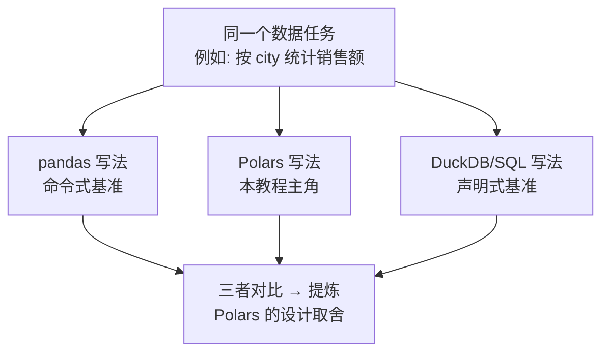
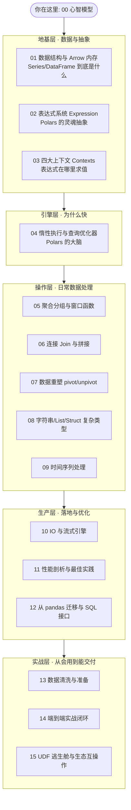

> 这是整套教程的地基。读完它，你会得到一张"认知地图"——知道 Polars 在数据处理生态里站在哪个位置、为什么快、以及后面 15 节每一节在解决什么问题。**后续每一节都会回指这张地图。**

---

## 一句话定位

**Polars 是一个用 Rust 写的、基于 Apache Arrow 内存格式、带查询优化器的 DataFrame 引擎。**

这句话里有四个关键词，每一个都对应一个"它为什么和 pandas 不一样"的理由：

| 关键词 | 含义 | 带来的后果 |
| --- | --- | --- |
| **Rust** | 底层无 GIL、内存安全、零成本抽象 | 天然多线程并行，不像 pandas 受 Python GIL 束缚 |
| **Apache Arrow** | 列式内存布局，业界标准 | 缓存友好、SIMD 向量化、与其他工具零拷贝互通 |
| **查询优化器** | 有一个"编译"阶段（Lazy 模式） | 你写的代码会被重排/裁剪后再执行，像数据库而非脚本 |
| **DataFrame 引擎** | 面向表格数据的运算库 | 定位与 pandas 相同，但实现哲学完全不同 |

---

## 心智模型：不要把它当"更快的 pandas"

这是初学者最容易踩的坑。如果你把 Polars 当成"API 长得有点怪的 pandas"，你会处处别扭。**正确的心智模型是：Polars 更像一个"你用 Python 语法书写、但由 Rust 引擎执行的查询语言"。**

用一个类比来锚定三个工具的差异——这也是本教程始终使用的"对照组"：



**核心洞察**：
- **pandas** 是命令式的——你写的每一行代码立刻执行，引擎没有"全局视野"，无法帮你优化。
- **DuckDB / SQL** 是声明式的——你描述结果，优化器全权决定执行顺序，但你被 SQL 语法框住。
- **Polars** 想要两者的优点：用 Python 表达式（灵活、可组合、可断点调试），但在 Lazy 模式下又有 SQL 那样的查询优化器（谓词下推、投影裁剪、并行调度）。

> 记住这句话，它会贯穿全书：**"Polars = pandas 的手感 + DuckDB 的大脑"。**

---

## 为什么快？四个确定性的原因

"快"不是玄学。Polars 的速度来自四个可以逐一验证的工程决策，而不是某个魔法开关。我们在第 11 节会用 benchmark 计时对比真实测量，这里先建立因果链：



1. **列式内存（Columnar）**：pandas 也主要用 NumPy/扩展数组按列或列块存储，并不是行式数据库。Polars 的优势在于采用一致的 Arrow 兼容列式布局，并让表达式引擎直接围绕这些缓冲区执行。做 `sum(price)` 时只需扫描对应列，利于缓存与向量化。这也是第 01 节的主题。

2. **多线程并行**：Python 有 GIL，pandas 大部分操作跑在单核。Polars 的计算发生在 Rust 层，天然多线程——一个 `group_by` 会被自动切分到所有 CPU 核心。

3. **查询优化器**：这是 Polars 相对 pandas 最"降维"的优势。Lazy 模式下你的整段代码会先变成一个逻辑计划（query plan），优化器对它做**谓词下推**（把过滤条件推到数据源，能少读就少读）、**投影下推**（只读你真正用到的列）等变换，然后才执行。第 04 节专门拆解。

4. **向量化 + SIMD**：底层用 SIMD 指令一次处理多个数据点，而不是 Python 层的逐元素循环。

---

## 两种执行模式：Eager 与 Lazy（全书最重要的分叉）

这是你必须在第一天就刻进脑子的区分。Polars 有两套 API：



| 维度 | Eager（急切） | Lazy（惰性） |
| --- | --- | --- |
| 入口 | `pl.read_csv` / `pl.DataFrame` | `pl.scan_csv` / `df.lazy()` |
| 执行时机 | 每行代码立即执行 | 直到 `.collect()` 才执行 |
| 是否优化 | 否（无全局视野） | **是（查询优化器介入）** |
| 类比 | pandas 脚本 | SQL / 数据库查询 |
| 适用 | 交互探索、小数据、调试 | 生产管道、大数据、性能敏感 |

**推荐策略（带 tradeoff）**：
- **探索期用 Eager**：写一步看一步，快速验证想法。
- **固化为管道后切 Lazy**：把探索好的逻辑改成 `scan_* + collect`，让优化器接管。数据越大、管道越长，下推和消除无用计算的收益通常越明显。
- 生产管道通常优先考虑 Lazy，因为它只在真正需要结果时才计算，并给优化器全局视野；但单个内存操作不保证比 Eager 更快。本教程会先用 Eager 讲清语义，再在第 04 节进入 Lazy 思维。

---

## 全书的对照方法论

你不会孤立地学 Polars。关键章节会针对适合横向比较的任务给出 pandas、Polars 与 DuckDB/SQL 写法；其他章节则集中讲 Polars 独有的执行或类型能力：



- **pandas 作为主对照**：它大概率是你的旧经验来源，逐一对照能让你"翻译"已有知识，并看清哪些 pandas 习惯是反模式。
- **DuckDB / SQL 作为副对照**：它代表声明式的极致。当你发现"Polars 的 Lazy 计划和 SQL 的执行计划惊人地像"，你就真正理解了 Polars 的大脑。

---

## 这套教程的地图（15 节各自解决什么）

下面是全书结构。**这不是目录，而是一条学习路径**——从"数据长什么样"到"如何写得快"，层层递进：



- **地基层（01–03）**：搞懂 Polars 的三个核心抽象——数据结构、表达式、上下文。这是 Polars 与 pandas 分道扬镳的地方，也是"Polars 手感"的来源。**不懂表达式，就永远只会写"翻译腔"的 Polars。**
- **引擎层（04）**：理解 Lazy 与查询优化器。这是 Polars 的"大脑"，也是它相对 pandas 的核心优势。
- **操作层（05–09）**：覆盖高频数据处理任务，并在适合的主题中加入 pandas/SQL 对照。
- **生产层（10–12）**：如何读写大数据、如何测量和优化性能、如何从 pandas 平滑迁移。
- **实战层（13–15）**：把前面的"能力切片"串成真实项目——系统化清洗、端到端 ETL，以及内置能力用尽时的 UDF 逃生舱。

---

## 配套代码怎么跑

每节都有一个可独立运行的脚本，位于 `code/` 目录。所有脚本共用 `code/00_generate_data.py` 生成的数据集（电商订单，含刻意注入的脏数据）。

```bash
# 第一步：生成数据集（只需运行一次）
uv run code/00_generate_data.py

# 之后按节运行，例如：
uv run code/01_data_structures.py
uv run code/02_expressions.py
```

本节配套代码 `code/00_intro.py` 会用一个**端到端的小例子**，让你在 30 秒内直观感受"同一个任务，pandas / Polars Eager / Polars Lazy / DuckDB 四种写法"的差异——建议现在就去跑一遍，再回来读第 01 节。

---

## 本节要点回收

1. Polars = **pandas 的手感 + DuckDB 的大脑**，不要当成"更快的 pandas"。
2. 快的四个确定性原因：**列式内存、多线程、查询优化器、SIMD 向量化**。
3. 最重要的分叉是 **Eager vs Lazy**：探索用 Eager，生产用 Lazy。
4. 全书用 **pandas（命令式）+ DuckDB/SQL（声明式）** 双对照来定位 Polars 的设计取舍。

下一节，我们把"DataFrame 到底是什么"这个问题拆到内存布局层面。
